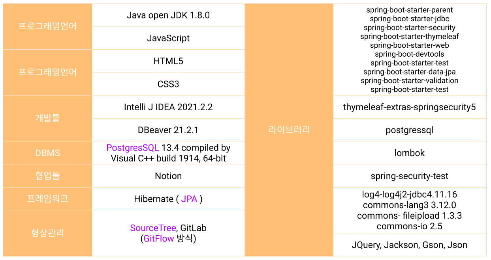
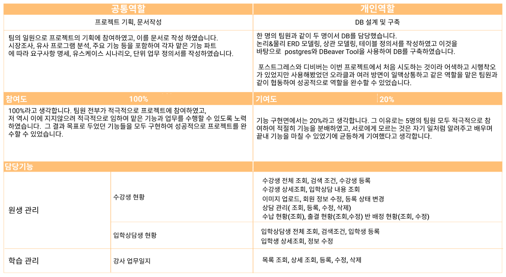
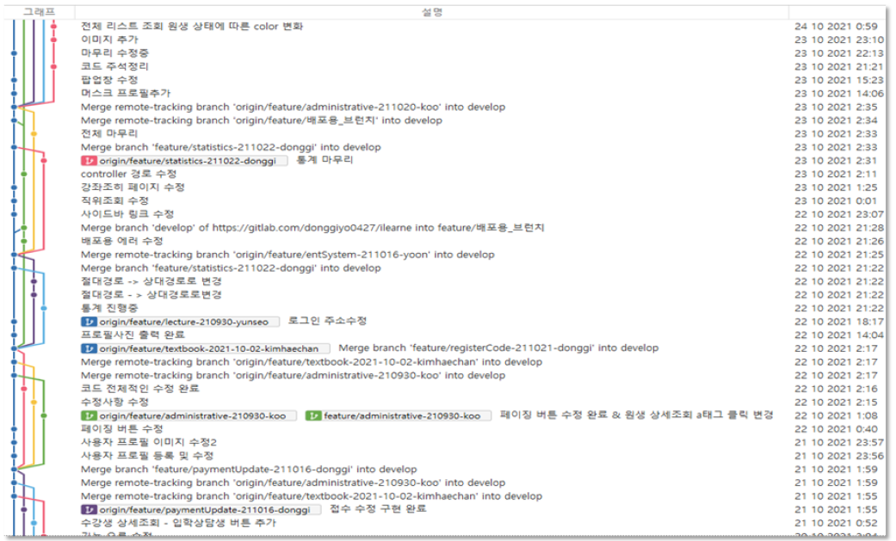

# I LEARN E(아이러니)

### 프로젝트 소개

팀원 : 5명

개발 기간 :  2021.09.23 \~ 2021.10.27



### 개발 환경

&#x20;이 프로젝트의 개발 환경 **특징으로는 국비 학원에서 배우지 않은 여러 스킬들을 사용한 것** 입니다.&#x20;

Postgres와 JPA를 사용하기로 정하면서 형상관리 툴도 SourceTree를 개발 툴은 Intelli J와 DBeaver를 사용하기로 결정했습니다.&#x20;

배운 것에서 안주하는 것이 아니라 도전하고 시도하는 창의적인 분위기가 팀 내에 형성되어 있었기 때문에 이러한 시도를 과감히 할 수 있지 않았나 싶습니다. &#x20;

여러 시행착오를 겪으며 개발 시작 일정이 계획했던 일자보다 뒤로 미뤄졌지만 결국 성공적으로 기한 내에 프로젝트를 마칠 수 있었습니다.

### 공통/개인 역할

### 형상관리

&#x20;여러 개의 기능들을 구현하면서 우선순위가 높은 기능들을 먼저 처리할 수 있는 병렬 형태의 브랜치 전략을 이용하면 더욱 효율적일 것 이라 판단하여 Gitflow 전략을 시도해보았습니다. 따라서 시각적UI인 그래프를 나타내주는 tool인 sourcetree를 채택하였습니다.&#x20;

&#x20;하지만 사용법도 쉽지 않았고 팀 전원이 습득을 해야 했기 때문에 여러 이슈가 발생하였지만 시간이 지날수록 익숙해졌고 결과적으로 이전 방법보다 기능 단위로 각자의 브랜치를 관리 할 수 있다는 점에서 훨씬 효율적으로 형상 관리를 해 낼 수 있었습니다.

* 아이러니 프로젝트를 진행하며 나온 산출물입니다.



