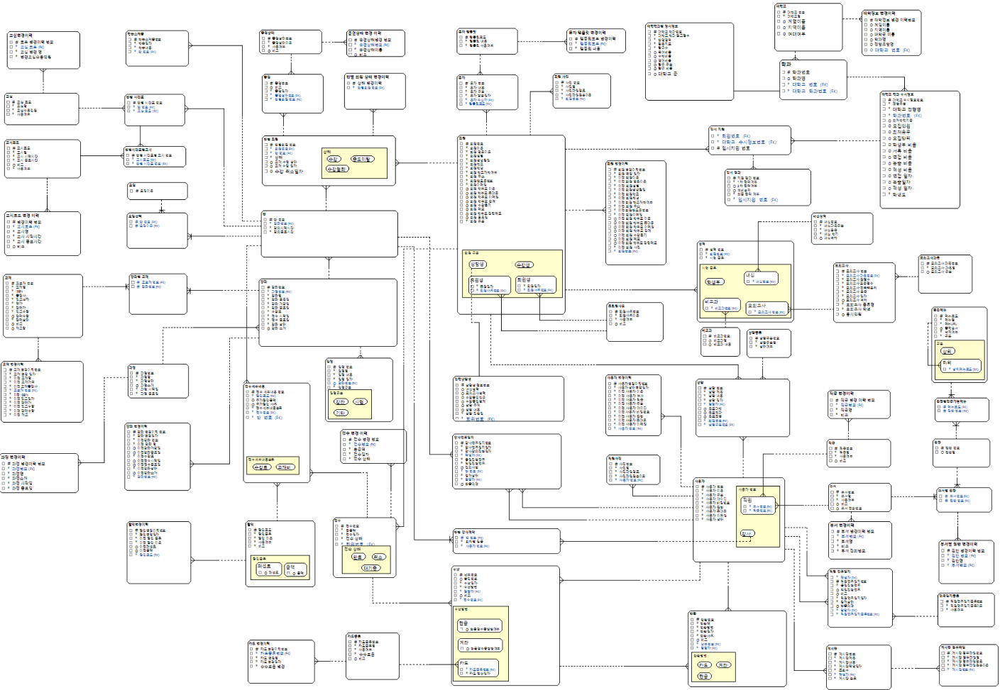
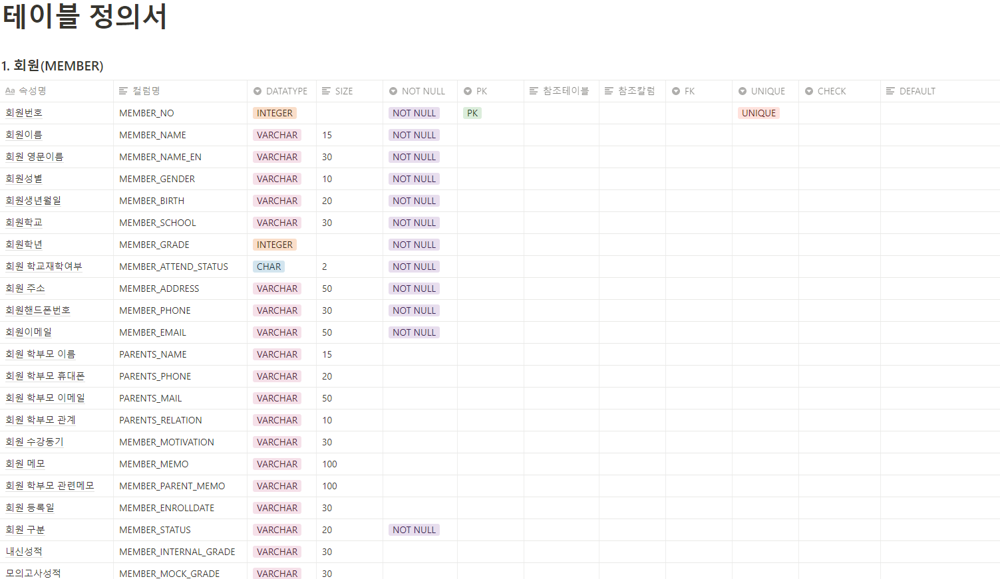
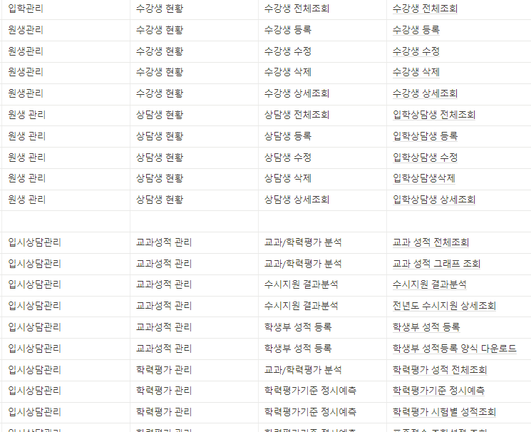
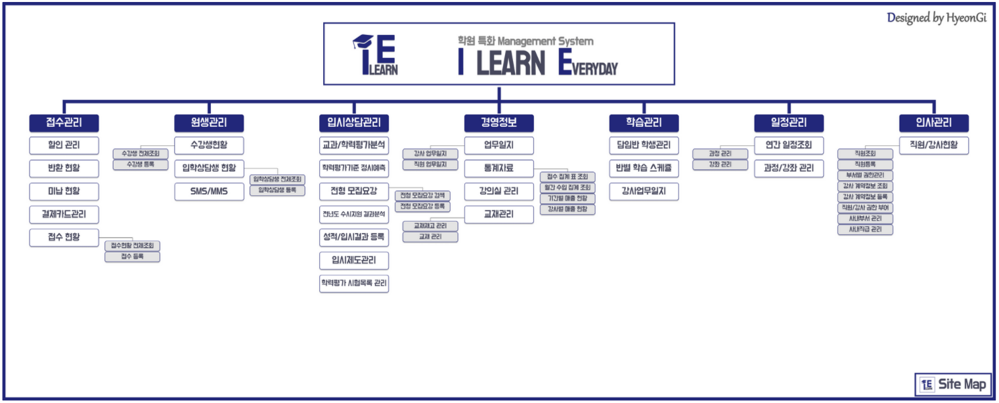
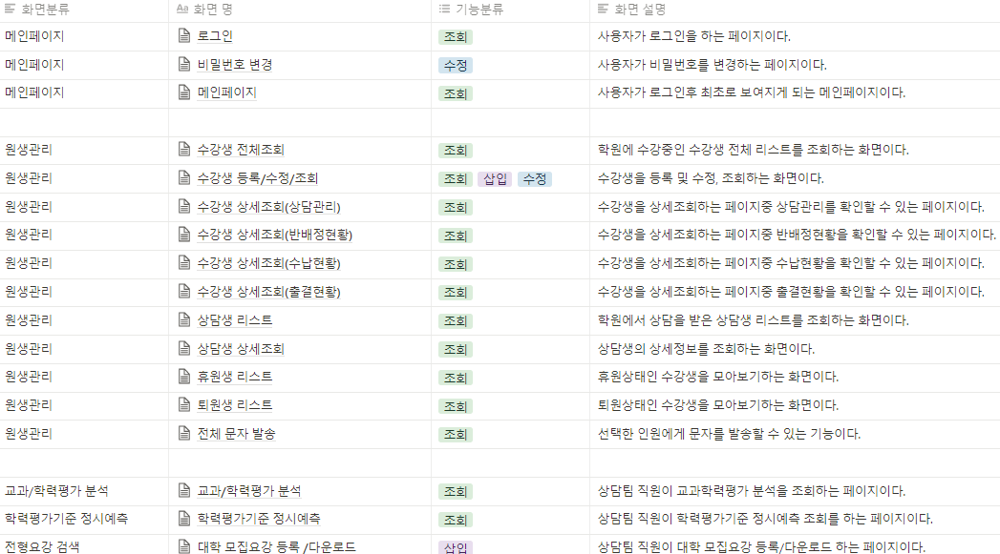
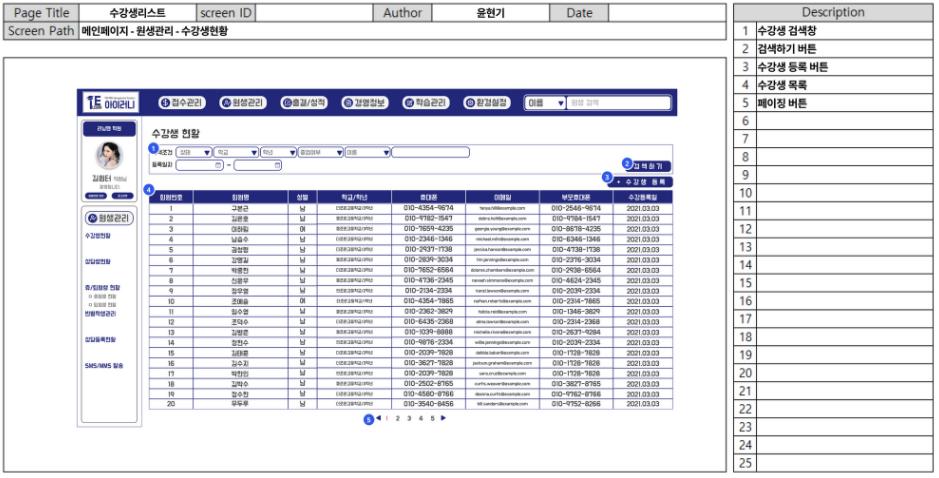

# 설계

## 1.데이터 베이스 설계

엔코아의 DA#을 활용하여 현재 DAP 시험의 표기법으로 채택되어 사용 중인 Baker 표기법으로 총 72개의 테이블을 설계하였습니다.

처음 엔티티를 설정 할 때는 팀원들과 같이 각자 맡은 기능에 대하여 뼈대를 잡았습니다.

초기에 함께 모델링을 참여함으로서 각자 기능에 대한 테이블 연관 관계 이해도를 높여 추후에 있을 개발 구현의 속도 향상에 기대를 할 수 있었기 때문입니다.

### 1-1. 논리 데이터 베이스 모델링 (ERD)

초기 버전 모델입니다. 큰 틀에 대하여 먼저 엔티티를 생성해두었습니다.

2차 수정안 입니다.&#x20;

본격적으로 이력 테이블과 입시 상담 기능을 진행 할 때 필요한 테이블 엔티티와 속성을 설정하였습니다.

이 때 부터 DB담당인 저와 다른 팀원 한 명이 미리 모델링을 하고 나서 팀원들에게 보여주어 피드백을 받는 형식으로 작업하였습니다.

&#x20;

3차 수정안 입니다.

빠트린 이력 관리 테이블을 추가하고, 접수와 수납 그리고 대학 입시에 관련한 기능에 대하여 팀원들에게 피드백을 받아 수정하였습니다. 이 후 이 모델링으로 테이블 정의서를 작성 후  물리 데이터 베이스 모델로 전환하고 스크립트를 출력하여 데이터 베이스를 설계하였습니다.

위의 3차 수정안으로 개발 구현을 진행하고 있었지만, JPA를 사용하다 보니 개발하는데 구조적인 문제가 발생하였습니다.

&#x20;해당 발생 이슈인 대학 입시 상담 기능 부분에서 세부적으로 나눈 테이블을 하나로 합치거나 제거하였고 접수와 수납 부분에서도 관계선을 새로 추가하거나 없애는 등 해당 기능을 맡은 팀원의 피드백을 받으며 함께 수정을 하였습니다.&#x20;

### 1-2. 상관 모델링&#x20;

업무들간의 상관 관계를 분석하여 다음과 같이 crud 흐름을 나타냈습니다

### 1-3. 테이블 정의서&#x20;

생성한 테이블의 컬럼명, ID, TYPE, SIZE 등 속성 등 내용을 상세히 정하는 작업입니다.&#x20;

이후 물리데이터 베이스 모델을 만들어 DB로 구축을 했습니다. 하지만 Postgres에서는 number타입이 없고 integer타입이여서 한번 더 수정 작업을 거쳤습니다.&#x20;

## 2. 기획 및 화면 설계&#x20;

### 2-1. 정책 정의서

웹 운영 정책이랑 권한 정책입니다.  팀원들과 회의를 통해 부서에 따라 CRUD의 제한을 두고 이에 맞게 구현을 하도록 결정하였습니다.&#x20;

### 2-2. Information Architecture(IA)&#x20;

정보 구조도 (IA) 입니다.  Depth가 같거나 유사한 것 끼리 묶어서 분류를 하였습니다. 이를 통해 어떤 기능의 화면으로 보여지는지 파악하는데 한층 더 이해하기 편했습니다.&#x20;

### 2-3. 메뉴 구조도(사이트맵)

각 메뉴를 나타냈고 안의 콘텐츠는 어떻게 표현되는지를 한 눈에 보이게 화면의 상하 구조에 따라 완성하였습니다.  이를 통해 프로젝트의 전체적인 구조를 확정 하였습니다.&#x20;

### 2-4. 화면 목록 및 화면 정의서(스토리보드)

각각의 화면마다 화면의 안의 기능에 번호를 달아 어떠한 이벤트인지 설명을 적어주었습니다. 작성하면서 구현할 파트의 이해도를 높이고, 또 시각적으로 정보를 확인하다 보니 다른 팀원의 기능도 보고 이해하는데 원활했습니다.

## 3. 프로그램 설계

각 팀원마다 담당 역할에 대해 프로그램 목록을 작성하였습니다.&#x20;

&#x20;기능에 맞는 package, controller Class, Method Name, URL, 구현 방식(동기,비동기), 권한, HTML Name 등 미리 작명을 하였습니다. 실제로 구현 할 때 여기 작성한 작명을 사용하였고, 바뀌는 것들은 수정을 해주었습니다.&#x20;

&#x20;이를 통해 팀원들과 겹치는 작명 없이 진행 할 수 있었고, 기능에 대해 어떻게 구현할지에 대해 로직을 정하는 단계였습니다.

