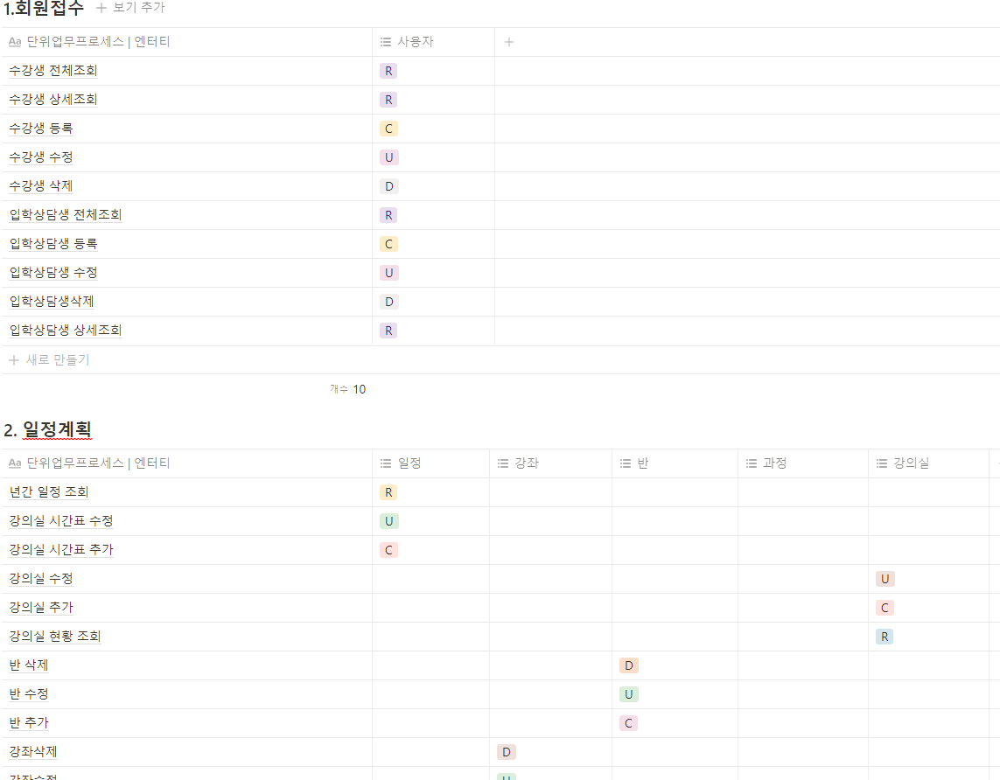

# 설계

## 1.데이터 베이스 설계

엔코아의 DA#을 활용하여 현재 DAP 시험의 표기법으로 채택되어 사용 중인 Baker 표기법으로 총 72개의 테이블을 설계하였습니다.

처음 엔티티를 설정 할 때는 팀원들과 같이 각자 맡은 기능에 대하여 뼈대를 잡았습니다.

초기에 함께 모델링을 참여함으로서 각자 기능에 대한 테이블 연관 관계 이해도를 높여 추후에 있을 개발 구현의 속도 향상에 기대를 할 수 있었기 때문입니다.

### 1-1. 논리 데이터 베이스 모델링 (ERD)

초기 버전 모델입니다. 큰 틀에 대하여 먼저 엔티티를 생성해두었습니다.

2차 수정안 입니다.&#x20;

본격적으로 이력 테이블과 입시 상담 기능을 진행 할 때 필요한 테이블 엔티티와 속성을 설정하였습니다.

이 때 부터 DB담당인 저와 다른 팀원 한 명이 미리 모델링을 하고 나서 팀원들에게 보여주어 피드백을 받는 형식으로 작업하였습니다.

&#x20;

3차 수정안 입니다.

빠트린 이력 관리 테이블을 추가하고, 접수와 수납 그리고 대학 입시에 관련한 기능에 대하여 팀원들에게 피드백을 받아 수정하였습니다. 이 후 이 모델링을 물리 데이터 베이스 모델로 전환하고 스크립트를 출력하여 데이터 베이스를 설계하였습니다.

위의 3차 수정안으로 개발 구현을 진행하고 있었지만, JPA를 사용하다 보니 개발하는데 구조적인 문제가 발생하였습니다.

&#x20;해당 발생 이슈인 대학 입시 상담 기능 부분에서 세부적으로 나눈 테이블을 하나로 합치거나 제거하였고 접수와 수납 부분에서도 관계선을 새로 추가하거나 없애는 등 해당 기능을 맡은 팀원의 피드백을 받으며 함께 수정을 하였습니다.&#x20;

### 1-2. 상관 모델링&#x20;

업무들간의 상관 관계를 분석하여 다음과 같이 crud 흐름을 나타냈습니다

### 1-3. 테이블 정의서&#x20;

