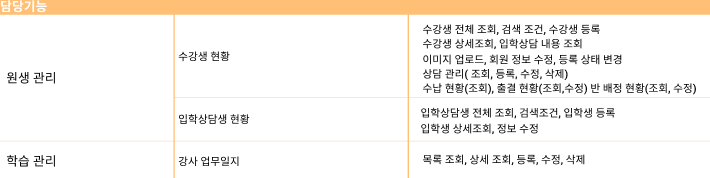

# 구현

앞의 기획과 설계를 바탕으로 다음과 같이 파트를 분배하여 구현에 들어갔습니다.

## &#x20;1. 파트 분배

### 인사 관리 & 일정 관리&#x20;

* 권한 관리&#x20;
* 직원&강사 관리
* 인사 코드 관리
* 강좌/과정 코드 관리

### 경영 정보 & 학습 관리

* 직원&강사 업무일지 관리&#x20;
* 강의실&교재 관리
* 담임 반 관리

### 접수 관리 & 통계

* 접수& 수납 관리
* 접수 코드관리
* 매출&수익 통계 관리

### 원생 관리& 학습 관리

* 수강생&상담생 관리
* 강사 업무일지 관리

### 입시 상담 관리 & 공통 레이아웃

* 교과 성적 관리
* 학력 평가 관리
* 입시제도 관리

## 2. 담당 기능

## 3. 구현 특징

####

