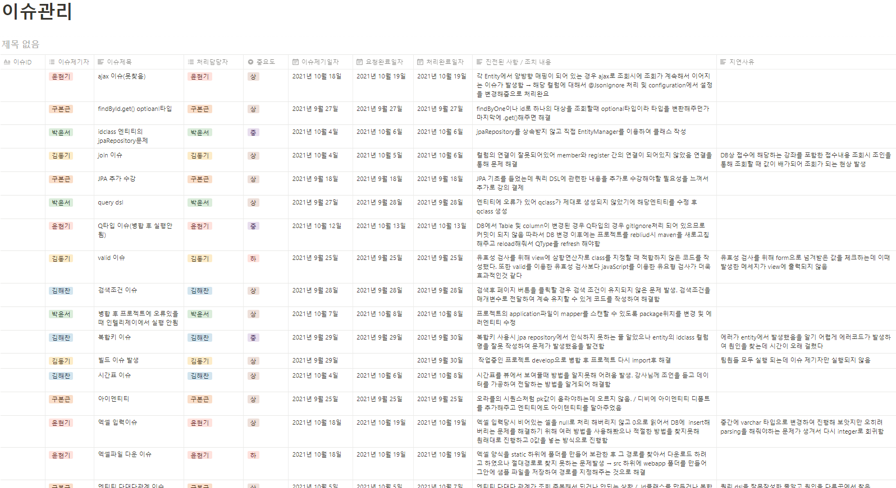
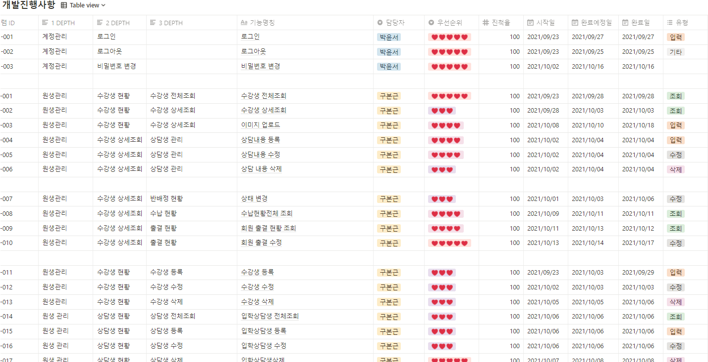
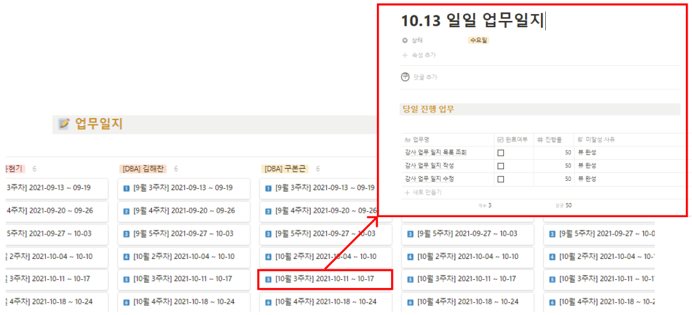

# 구현

## 1. 특징

기획이나 개발 하다 발생하는 이슈들에 대해 내용과 조치 사항, 지연 사유 등을 작성하여 정리하였습니다.&#x20;

같은 이슈가 발생 할 수 있기에 발생하는 이슈들을 관리하여 공유하고 팀원들과 함께 해결했습니다.

개발 진행 사항입니다.

각자 맡은 바 기능을 리스트화 하여 중요도 표시를 하여 개발을 진행할 우선순위를 정하였고 구현 달성치를 파악하였습니다.  팀원의 개발 진행 사항을 파악할 수 있어 작업 현황의 공유가 수월하였으며, 시작일과 완료일을 파악할 수 있어 이 기간을 토대로 나머지 프로세스에 대해 일정을 조율할 수 있어 개발의 효율성을 높여주었습니다.

&#x20;팀원 모두가 개발 시작 전에 간략히 하루 목표치에 대해 회의를 하고 일지를 작성하고 개발을 하였습니다. 하루 개발이 끝나면 달성율을 업데이트해주고 목표에 미달성 하였으면 사유를 간략히 적어 문제점을 파악하여 추후 이어서 개발을 할 때 도움이 되었습니다.

## 2. 파트 분배

### 인사 관리 & 일정 관리&#x20;

* 권한 관리&#x20;
* 직원&강사 관리
* 인사 코드 관리
* 강좌/과정 코드 관리

### 경영 정보 & 학습 관리

* 직원&강사 업무일지 관리&#x20;
* 강의실&교재 관리
* 담임 반 관리

### 접수 관리 & 통계

* 접수& 수납 관리
* 접수 코드관리
* 매출&수익 통계 관리

### 원생 관리& 학습 관리  ( 담당 역할 )

* 수강생&상담생 관리
* 강사 업무일지 관리

### 입시 상담 관리 & 공통 레이아웃

* 교과 성적 관리
* 학력 평가 관리
* 입시제도 관리

## 3. 담당 기능

