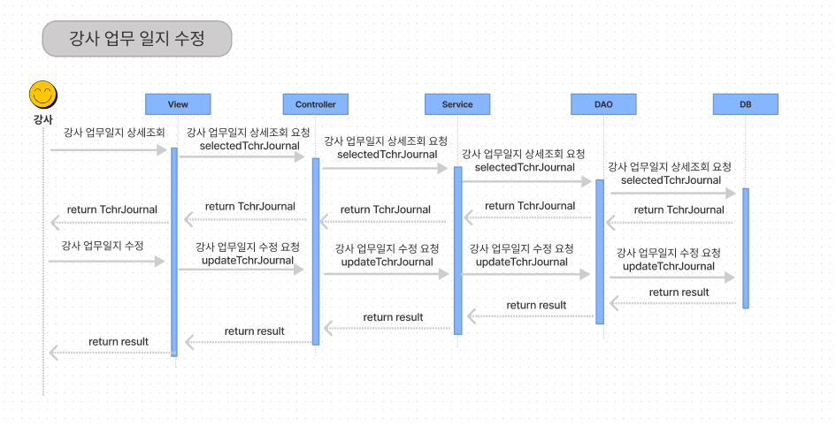

# 업무일지 상세조회/수정

## (1) 강사 업무일지 상세 조회

### A. 단위 업무 흐름도

.png>)

> 상세조회 할 업무 일지를 선택하면 DB에서 값에 맞는 업무일지를 조회하게 구현 할 예정입니다.&#x20;

### B. 데이터 베이스 모델링

.png>)

> 리스트 화면에 필요한 값인 반/강좌의 정보와 작성자 업무일지 작성 일자를 조회하기 위해 위처럼 모델링을 하였으며,  '작성자' 와 '결제자' 를 구분하기 위해 강사 업무 일지와 사용자 간의 N:1 관계선을 두 개로 사용하였습니다.

### C. 화면 정의서

.png>)

### D. 시퀀스 다이어그램

.png>)

> 리스트 조회 화면에서 상세조회 할 업무 일지를 선택하면 DB에 해당 id를 넘겨 id 값에 맞는 업무일지를 조회하게 구현 할 예정입니다.&#x20;

## 1-1) 구현 화면

.png>)

> 화면 정의서와 약간 다르게 구현하였습니다. 등록 할 때 조회하여 등록한 강좌에 따른 출결 현황 등 같은 부분이 본래의 화면 정의서에는 표기되지 않아 구현하면서 UI를 수정하여 완성시켰습니다.&#x20;
>
> 해당 화면에서 삭제와 수정도 가능하게 버튼을 구현하였습니다.&#x20;

## 1-2) 구현 코드

## (2) 강사 업무일지 수정&#x20;

### A. 단위 업무 흐름도

.png>)

> DB에서 하나의 업무일지에 대한 내용을 조회 하여 불러 온 뒤, 내용을 수정하여 수정하기 버튼을 누르면 DB에 update 되게 하는 방식으로 만들었습니다.

### B. 데이터 베이스 모델링

> 강사업무일지 테이블을 사용하여 수정을 하였습니다.&#x20;

### C. 화면 정의서

### D. 시퀀스 다이어그램

> DB에서 하나의 업무일지에 대한 내용을 조회 하여 불러 온 뒤, 내용을 수정하여 수정하기 버튼을 누르면 DB에 update 되게 하는 방식으로 하였습니다.

## 2-1) 구현 화면

.png>)

> 강사 업무일지 상세 조회 화면에서 내용을 수정 한 후 수정하기 버튼을 클릭하면 수정이 완료되게 구현하였습니다.

## 2-2) 구현 코드

