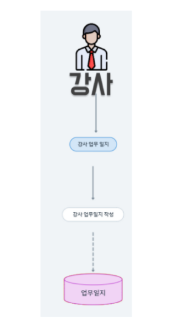
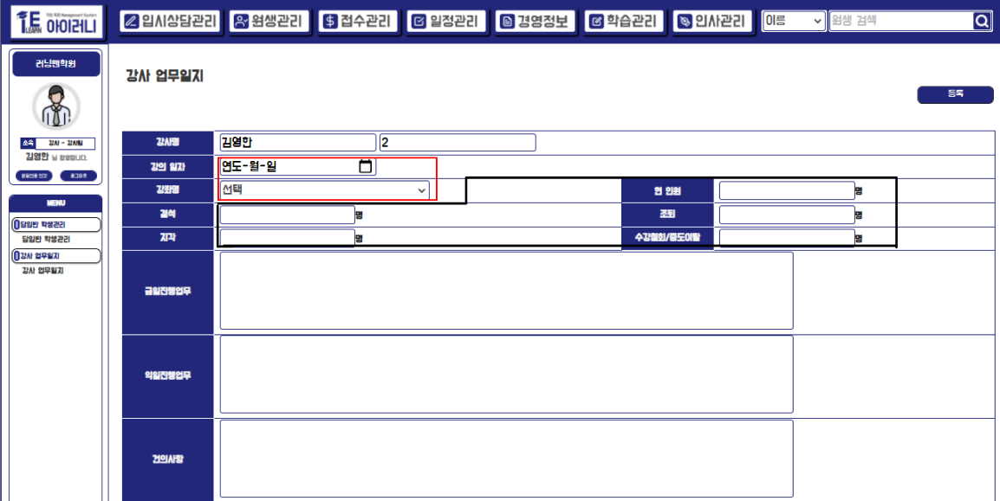
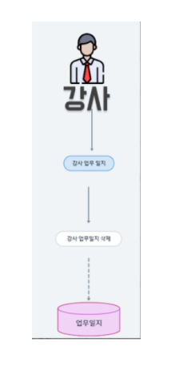

# 업무일지 등록/삭제

## (1)강사 업무일지 등록&#x20;

### A. 단위 업무 흐름도

> 강사 계정으로 로그인 한 후 학습관리의 강사 업무일지 메뉴에서 강사 업무일지 작성을 클릭하여 등록을 하면 DB에 insert가 되어 전체 리스트 화면에 보이게 하였습니다.&#x20;

### B. 데이터 베이스 모델링

.png>)

> '작성자' 와 '결제자'를 구분하기 위해 강사 업무일지와 사용자 간의 N:1 관계선을 두 개로 사용하여 모델링을 하였습니다. 반별 계약을 통해 현재 진행 중인 강좌를 조회해내 일지를 작성하게끔 구현하기 위해 위처럼 모델링을 하였습니다.&#x20;

### C. 화면 정의서

.png>)

> 강사 업무일지 화면 정의서 입니다. 강의 일자와 강좌명을 선택하여 해당 일자의 출결 현황을 작성하고 업무사항이나 특이 사항을 작성하여 등록하기 버튼을 누르면 등록이 가능하게 할 예정입니다.

### D. 시퀀스 다이어그램

.png>)

> 강사 업무일지 등록을 하면 DB에 작성한 정보가 insert되며 결과를 return 받는 형식으로 구현 할 예정입니다.&#x20;

## 1-1) 구현 화면

> 강의 일자와 강좌명을 선택하면 해당 일에 맞는 반(강좌)의 출결 상태가 조회되도록 ajax를 사용하였습니다.  현재 로그인 한 계정이 강사 명에 조회되도록 하였고, 일지 내용을 작성 후 등록 버튼을 누르면 등록이 완료되도록 구현하였습니다.&#x20;

## 1-2) 구현 코드

* 등록을 하기 위해 강사의 반 정보 등을 조회

.png>)

* 등록을 하기 위해 반의 출결 현황 조회

.png>)

.png>)

.png>)


위의 해당 로직으로 강의 일자와 강좌명을 선택하면 그 날 반의 출결 상태가 ajax로 하여 아래와 같이 view에 보여지게 됩니다.&#x20;


.png>)

* 위의 정보와 작성한 강사 업무일지 등록

.png>)

## (2) 강사 업무일지 삭제

### A. 단위 업무 흐름도

> 강사 업무 일지를 조회하여 삭제할 하나를 선택하여 삭제하면 DB에 삭제하여 리스트 조회 화면에서도 해당 업무 일지가 안보이게 하였습니다.&#x20;

### B. 데이터 베이스 모델링

.png>)

### C. 화면 정의서

.png>)

> 하나의 업무일지를 상세 조회 한 다음 삭제 버튼을 누르면 해당 업무 일지가 삭제됩니다.&#x20;

### D. 시퀀스 다이어그램

.png>)

> 하나의 강사 업무 일지를 삭제하면 DB에 delete 되고, 결과를 return 받는 형식으로 구현 할 예정입니다.

## 2-1) 구현 화면

.png>)

> 삭제하기 버튼을 누르면 confirm 창이 뜨게 되고 확인 버튼을 누르면 해당 업무 일지를 삭제할 수 있게 구현 하였습니다.&#x20;

## 2-2) 구현 코드

.png>)

