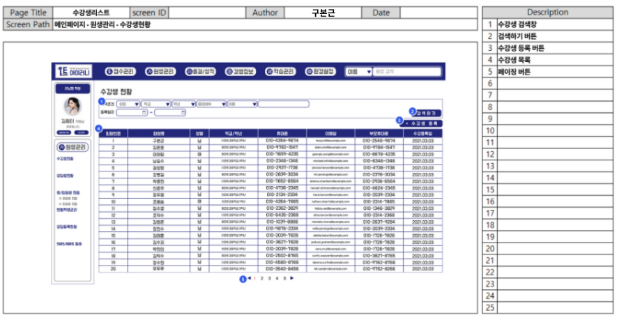
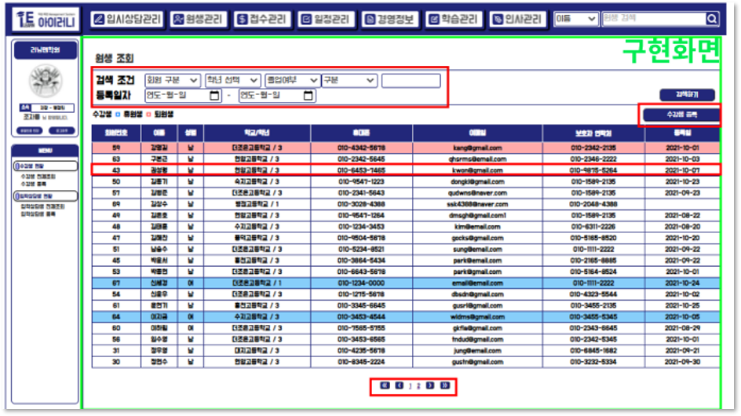
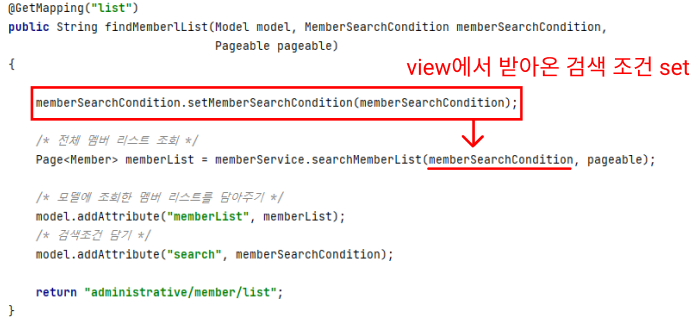
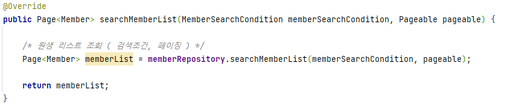
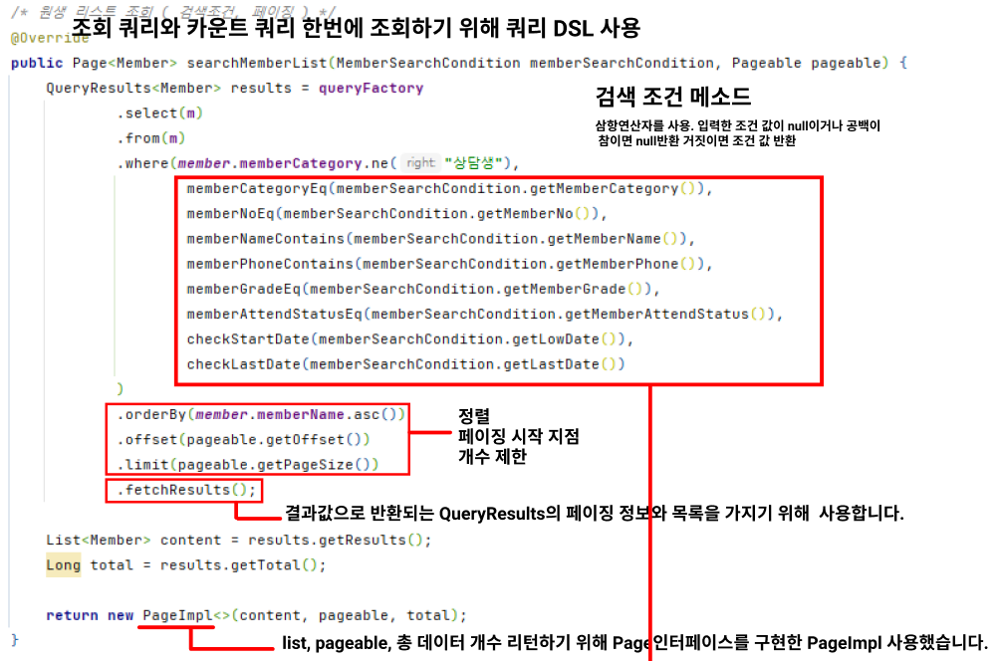
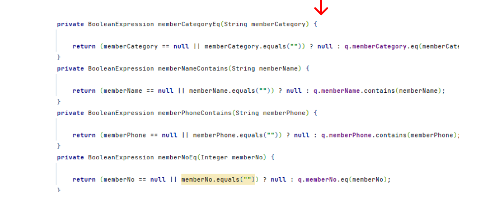
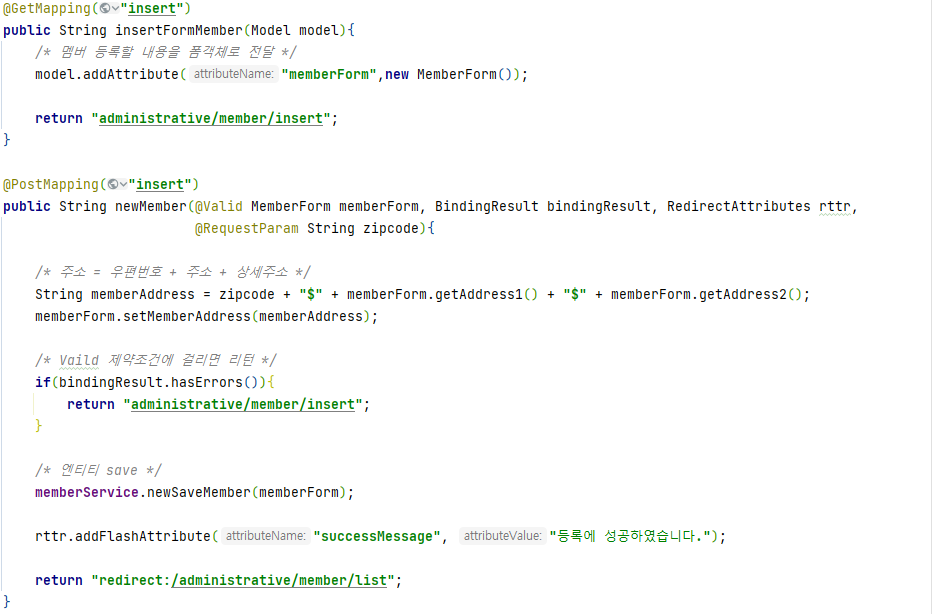
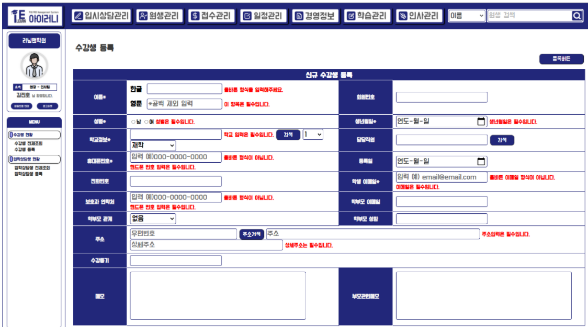
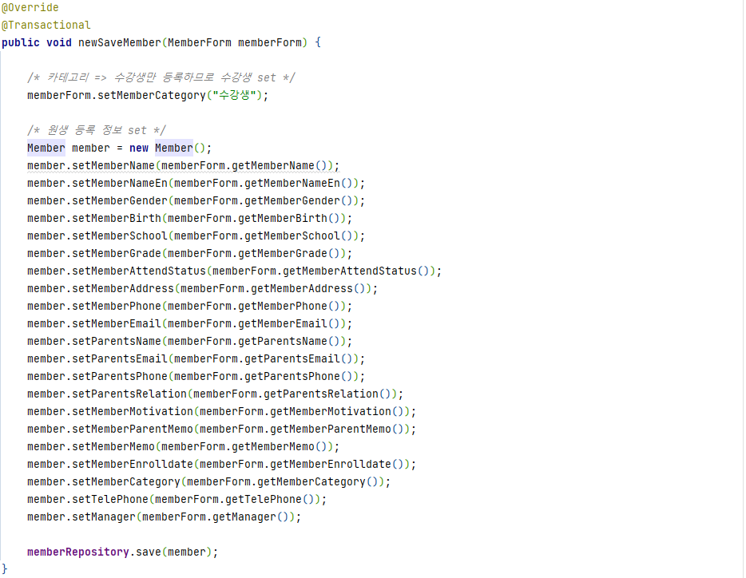
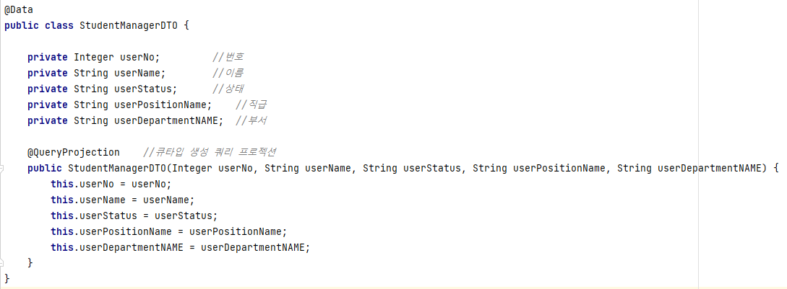

# 원생 관리

## 구현 화면 및 코드&#x20;

## 1) 수강생 전체 조회

### A. 단위 업무 흐름도

> 수강생 전체 조회는 메인 페이지에서 수강생 현황 메뉴 아래의 수강생 전체 조회를 선택하면 데이터 베이스에서 수강생 정보를 조회하여 화면에 보여주게 됩니다.

### B. 데이터 베이스 모델

> 해당 기능을 구현하기 위해 필요한 엔티티 입니다.&#x20;
>
> 회원 등록일이 Null 허용인 이유로는 1:1관계인 '입학 상담생' 테이블이 있어서 입니다.  접수를 동해 수납이 확인 되면 등록일이 자동으로 생성되지만 입학 상담생은 접수를 하지 않기 때문에 Not NUll 조건을 풀어주었습니다. &#x20;

### C. 화면정의서

> 권한이 있는 아이디로 로그인 후, 상단바의 원생 관리 탭을 클릭 후 수강생 현황에 들어가면 등록된 수강생의 현황 리스트가 조회되며  한 페이지에 총 20명씩 조회가 가능합니다.
>
> 검색 조건을 통해 특정인들을 따로 조회할 수 있고, 원하는 한명의 원생의 행을 클릭하면 상세 페이지로 이동합니다.  또 수강생 등록 버튼을 통해 등록 페이지로 이동이 가능합니다.

### D. 시퀀스 다이어그

### 1-1) 화면 설명

> &#x20;퇴원생은 빨간색 휴원생은 파란색으로 표시됩니다.

### 1-2) 구현 코드

* Controller


JPA를 사용하여 구현하였습니다.&#x20;

때문에 Member 엔티티를 생성 후 이를 객체 타입으로 전달해주었습니다.


* ServiceImpl


Repository에서 받은 결과를 memberList 변수로 받아 return 해주었습니다.


* RepositoryImpl


'상담생' 은 제외 하기 때문에 Where절을 통해 조건을 주었으며, 검색 조건들을 메소드로 만들어 조건 절에 포함 시켜 주었습니다. 검색 조건을 메소드로 만들어 주어  해당 로직 말고 다른 로직에서도 같은 검색 조건을 사용 할 수 있게 재사용성을 높일 수 있었습니다.&#x20;


## 2) 수강생 등록

### 화면 설명

> &#x20;한 명의 신규 수강생을 등록하는 화면입니다. 이름, 나이, 학교, 학년 등과 같은 학생의 정보를 입력할 수 있고, 카카오의 우편 주소 API를 사용하여 주소 검색을 하였습니다. 담당 직원도 검색 버튼을 통해 한 명의 담당 직원을 선택하여 입력 할 수 있습니다. &#x20;

### 구현 코드

* 등록을 위한 Form 객체


원생 등록 할 때 필요한 변수들을 선언해 주었고, hibernate-validator 어노테이션을 사용하여 필수 값을 예외 처리해주었습니다.


* 수강생 등록 Controller


view에서 사용자가 입력하여 전달 받은 객체인 MemberForm에 @Valid나 @Validated 어노테이션을 붙여주고 BindingResult를 사용하여 어떤 오류가 발생했나 알려주는 방법으로 예외처리를 하였습니다.(Validator를 상속받는 클래스에서 객체값을 검증하는 방식)


* 수강생 등록 ServiceImpl


등록 Form 객체에서 받은 값을 Member Entity에 set을 해주었습니다.

&#x20;Repository는 JPARepository를 상속받고 있어 제공해주는 save 메소드를 사용하여 등록을 완료하였습니다.&#x20;


* 직원 검색 DTO


직원 조회를 위한 DTO입니다. QueryDSL을 사용하기 위해서 QueryProjection 어노테이션을 달아주어 Q타입 객체 생성해주었습니다.


* 직원 검색 Controller

* 직원 검색 ServiceImpl

* 직원 검색 RepositoryImpl

## 3) 수강생 상세 조회

### 화면 설명

> 상세 조회 페이지 겸 수정 페이지 입니다.
>
> 상담생 관리, 반 배정 현황, 수납 현황, 출결 현황 탭으로 이동할 수 있는 기점 페이지이며 이미지 업로드와 수강생의 정보 수정이 가능합니다.&#x20;

### 구현 코드

.PNG>)

## 3-1) 상담생 관리

상담생 관리 탭을 구현 하면서 사용한 테이블 입니다.&#x20;

### A. 전체 리스트 조회

### 화면 설명

> 수강생의 상담 내역을 조회 할 수 있는 화면입니다.&#x20;
>
> 상담 구분 등 조건으로 검색을 통해 상담 내역을 찾을 수 있으며, 우측의 상담 내역 추가로 새로운 상담 내역을 등록 할 수 있습니다.&#x20;
>
> 조회 된 상담 내역을 보려면 상세보기 버튼을, 수정하려면 수정 버튼 삭제하려면 삭제 버튼을 누르면 해당 기능이 수행 됩니다.

### 구현 코드&#x20;

.PNG>)

## 3-2) 반 배정 현황

## 3-3) 수납 현황

## 3-4) 출결 현황&#x20;

###

