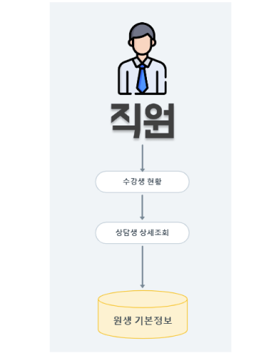
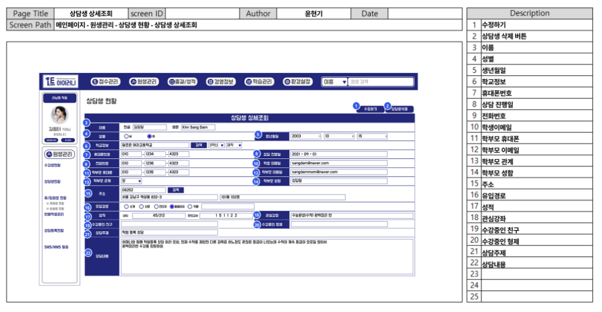
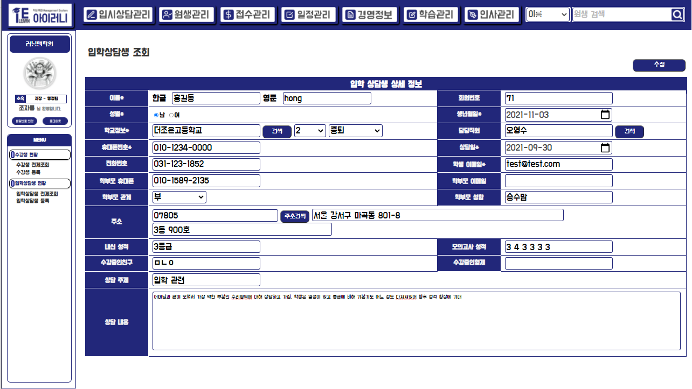
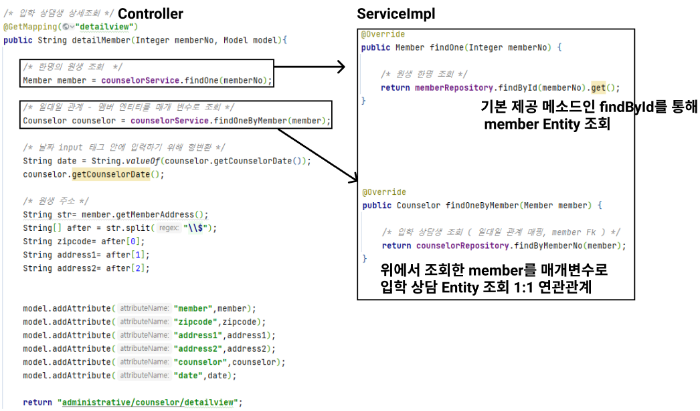

# 입학 상담생 상세조회

## A. 단위 업무 흐름도

> 입학 상담생 상세 조회는 입학 상담생 현황 메뉴 아래의 입학상담생 전체 조회를 선택하고, 특정 회원의 row(행)을 클릭하면 데이터 베이스에서 수강생 정보를 조회하여 화면에 보여주게 됩니다.

## B. 데이터 베이스 모델링

> 회원 엔티티와 많은 속성을 공유하기 때문에 입학 상담생 테이블을 따로 만들어 공유하지 않는 속성을 추가하여 주고 1대1 연관 관계로 하여 모델링을 만들었습니다.&#x20;

## C. 화면 정의서

> 특정 한 명의 정보와 입학 상담 내용을 조회 할 수 있는 화면으로 구현 할 생각입니다.

## D. 시퀀스 다이어그램

> 전체 리스트 조회 화면에서 특정 한 명의 상담생을 클릭하면 DB에서 해당 회원의 정보를 return 받게 구현 할 예정입니다.

## 구현 화면

> 실제 구현 화면입니다. 전체 리스트 조회 화면에서 자세한 정보를 보고 싶은 특정 회원의 row(행)을 클릭하면 해당 화면으로 이동하게 구현하였습니다.
>
> &#x20;화면 정의서와 크게 달리진 부분은 없지만 실제 화면에서는 삭제 버튼을 없앴습니다. 굳이 상담한 내용을 삭제할 필요성이 없다고 느껴 간단한 회의를 통해 삭제 기능을 없앴습니다.&#x20;

## 구현 코드

