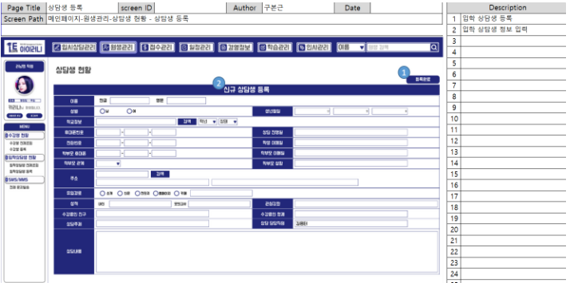

# 입학 상담생 등록/수정

### A. 단위 업무 흐름도

> 입학 상담생 등록은 메인 페이지에서 수강생 현황 메뉴 아래의 상담생 등록을 선택하면  수강생 정보를 입력 할 수 있는 화면에 보여주게 되고, 정보를 입력 후 등록하면 DB에 정보가 insert가 됩니다.

> 입학 상담생 수정은 메인 페이지에서 수강생 현황 메뉴 아래의 전체조회을 선택합니다.
>
> 그 후 정보를 수정 할 특정 상담생을 클릭하면 DB에서 해당 상담생의 정보를 조회하여 수정할 수 있는 화면으로 이동이 되고, 내용을 수정 후 수정 완료 버튼을 누르면 DB에 정보가 update가 됩니다.

### B. 데이터 베이스 모델링

> 회원 엔티티와 많은 속성을 공유하기 때문에 입학 상담생 테이블을 따로 만들어 공유하지 않는 속성을 추가하여 주고 1대1 연관 관계로 하여 모델링을 만들었습니다.&#x20;

### C. 화면 정의서

* 등록 화면 정의서

> 입학 상담생 등록을 하기 위해서는 원생관리의 상담생 현황 메뉴의 등록하기를 누르면 등록 화면으로 이동이 가능합니다. 이 곳에서 입학 상담생의 정보를 입력 후 등록완료 버튼을 누르면 등록이 완료됩니다.&#x20;

* 수정 화면 정의서

> 입학 상담생의 정보를 수정하기 위해서는 상담생 현황의 전체 리스트 조회 화면에서 수정을 할 상담생의 row(행)을 클릭하면 수정화면(=상세조회 화면)으로 이동이 가능합니다. 이 곳에서 수정할 정보를 수정 후 수정하기 버튼을 클릭하면 수정이 완료됩니다.&#x20;

### D. 시퀀스 다이어그램

> 입학 상담생 등록을 클릭 후 정보를 입력하여 등록 완료를 누르면 DB에 insert가 되며 결과를 return 받게 할 예정입니다.

> 정보를 수정 할 특정 상담생을 클릭하면 DB에서 해당 상담생의 정보를 조회하여 return 받습니다.&#x20;
>
> 조회 된 내용 중 수정할 정보를 수정 후 수정 완료 버튼을 누르면 DB에 update가 되며 결과를 return 받게 할 예정입니다.&#x20;

## (1) 입학 상담생 등록

### 1-1) 구현 화면

> 실제 구현 화면입니다. 화면 정의서를 토대로 구현하였으며 약간의 UI나 위치만 바뀌었습니다.

### 1-2) 구현 코드

* Controller

* ServiceImpl

## (1) 입학 상담생 수정

### 1-1) 구현 화면

> 실제 구현 화면입니다. 전체 리스트 조회 화면에서 자세한 정보를 보고 싶은 특정 회원의 row(행)을 클릭하면 해당 화면으로 이동하게 구현하였고 해당 화면에서 수정이 가능하게 하였습니다.

### 1-2) 구현 코드

* Controller

* ServiceImpl

