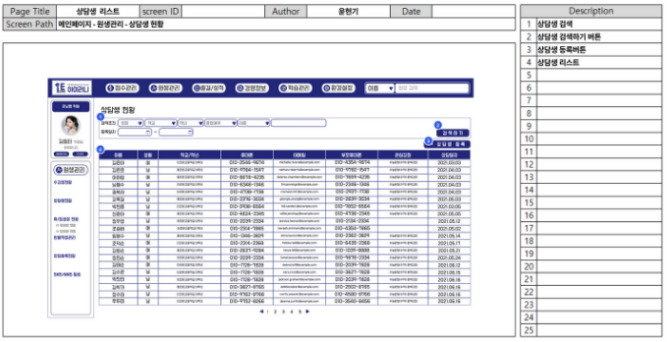
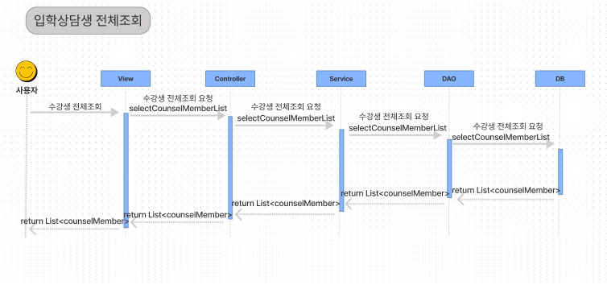
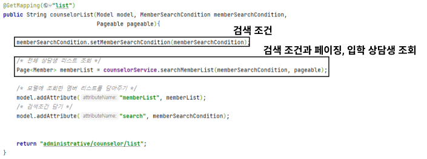
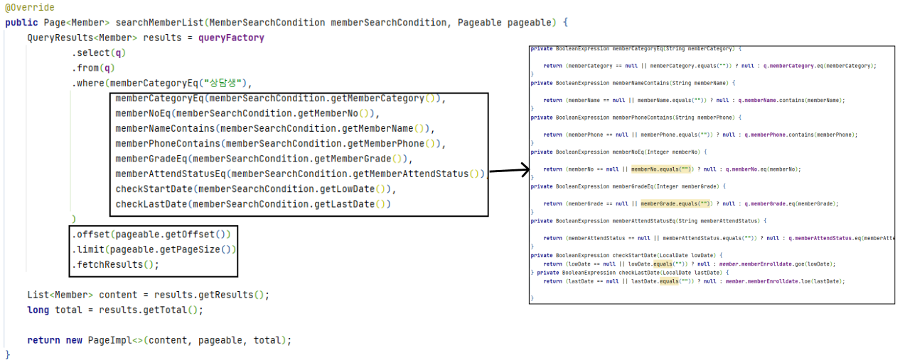

# 입학 상담생 전체조회

## A. 단위 업무 흐름도

> 입학 상담생 전체 조회는 메인 페이지에서 수강생 현황 메뉴 아래의 상담생 전체 조회를 선택하면 데이터 베이스에서 수강생 정보를 조회하여 화면에 보여주게 됩니다.

## B. 데이터 베이스 모델링

> 회원 엔티티와 많은 속성을 공유하기 때문에 입학 상담생 테이블을 따로 만들어 공유하지 않는 속성을 추가하여 주고 1대1 연관 관계로 하여 모델링을 만들었습니다.&#x20;

## C. 화면 정의서

> 권한이 있는 아이디로 로그인 후, 상단바의 원생 관리 탭을 클릭 후 입학 상담생 현황에 들어가면 등록된 상담생의 현황 리스트가 조회되며  한 페이지에 총 20명씩 조회가 가능합니다.
>
> 검색 조건을 통해 특정인들을 따로 조회할 수 있고, 원하는 한명의 원생의 행을 클릭하면 상세 페이지로 이동합니다.  또 등록 버튼을 통해 등록 페이지로 이동이 가능합니다.
>
> 수강생이 상담 하는 상담생과 입학 상담의 구분을 하기 위해 후에 입학 상담생으로 네이밍을 결정하였습니다.

## D. 시퀀스 다이어그램

> 입학 상담생 전체조회 메뉴를 클릭하면 DB에서 '상담생' 으로 분류된 회원을 list로 return 받아 화면에 뿌려주게 하였습니다.

## 구현 화면

> 보여지는 데이터 값은 '상담생' 으로  나머지 부분은 '수강생 전체 리스트 조회' 화면과 같습니다.&#x20;

## 구현 코드


해당 로직은 '수강생 리스트 전체 조회'와 같습니다.&#x20;

조건문만 다르게 하여 주어 입학 상담생만 조회되게 하였습니다.

수강생 리스트 전체 조회를 보시려면 아래 글을 클릭해주세요.



[undefined.md](../undefined/undefined.md)


