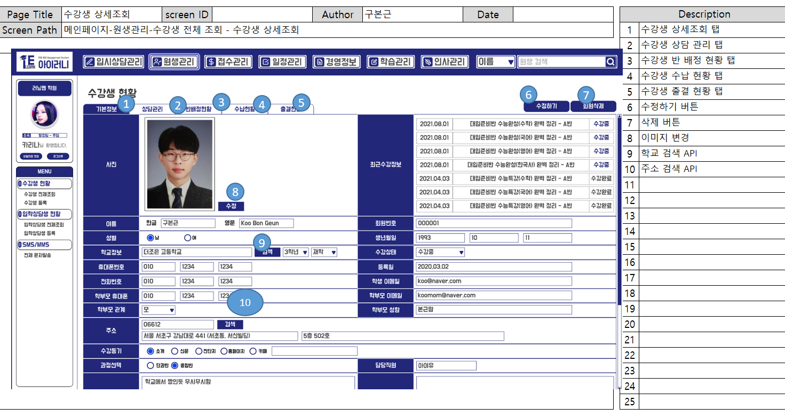

# 수강생 상세 조회

## 3) 수강생 상세 조회

### A. 단위 업무 흐름도

> 수강생 정보를 상세 조회 하기 위해서 수강생 현황의 전체 리스트를 우선 조회합니다. 그 후 상세 보기를 원하는 한 명의 원생을 클릭하면 해당 원생의 정보를 상세 보기 할 수 있습니다.&#x20;

### B. 데이터 베이스 모델

> 특정 수강생의 최근 수강 정보를 조회하기 위해 해당 5개의 테이블을 사용하였고,
>
> 수강생의 정보를 조회하기 위해 회원 테이블을 사용하였습니다. &#x20;

### C. 화면 정의서

> 상세보기 화면 정의서 입니다. 수정도 동시에 할 수 있는 화면이며** '상담 관리', '반 배정 현황', '수납현황', '출결 현황'의 탭으로 이동 할 수 있는 **<mark style="color:orange;">**기점 화면**</mark> 이기도 합니다.

### D. 시퀀스 다이어그램

### 1-1) 구현 화면

.PNG>)

> 상세 조회 페이지 구현 화면 입니다.  화면 정의서와 다른 점으로는** '수강생 삭제' 버튼을 없앴습**니다.&#x20;
>
> **대신 수강생의 상태를 변경하는 기능을 넣었으**며, ** '입학 상담' 을 진행한 기록이 있는 회원**이면 상태 변경 기능 옆에** '입학상담내용' 버튼이 보이도록 화면**을 **구현**하였습니다.

### 1-2) 구현 코드


여기서 직원 검색은 수강생 등록과 같은 로직이므로 생략하겠습니다.

이미지 변경 기능은 따로 목차를 만들었습니다.&#x20;


* controller

.PNG>)

* serviceImpl

* RepositoryImpl

