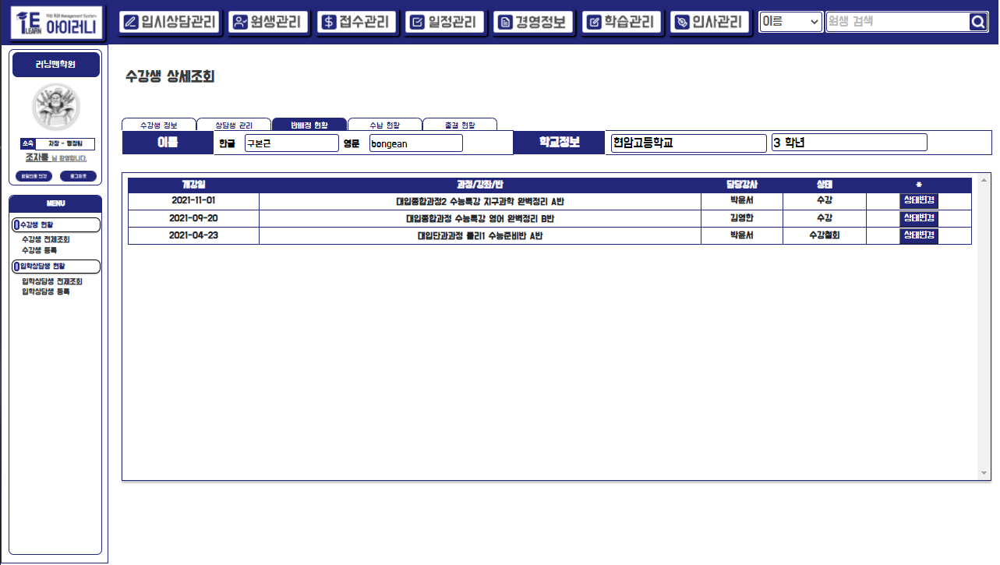
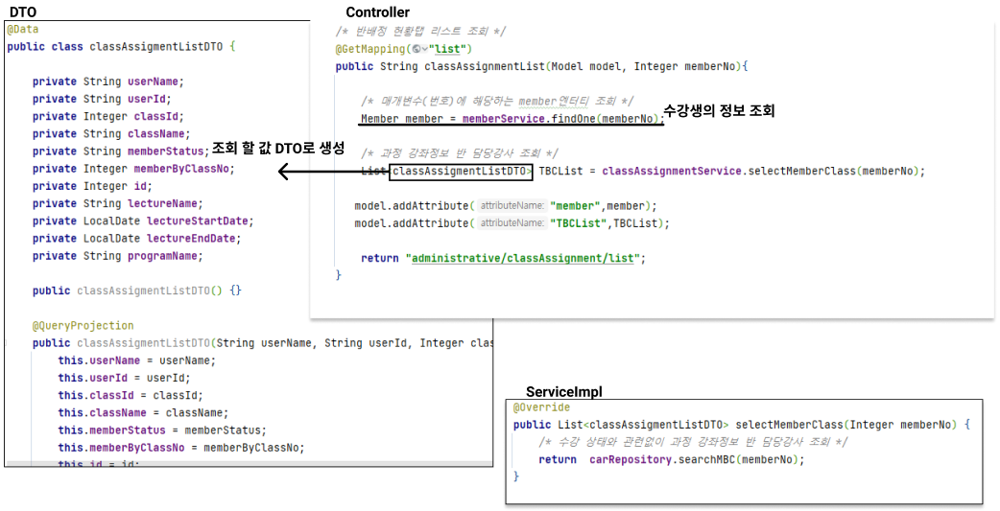
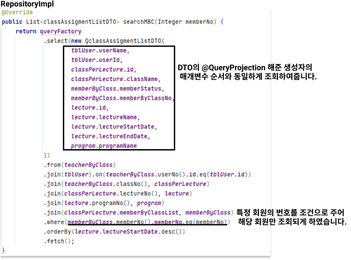
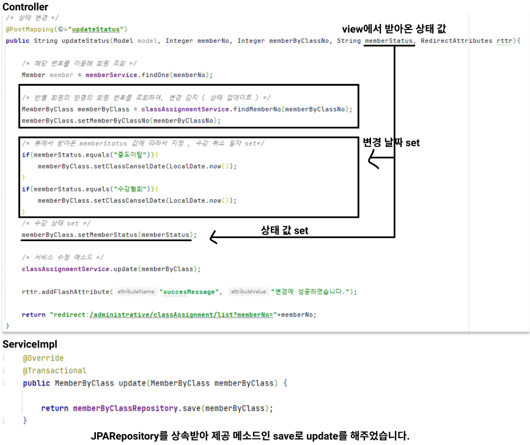

# 반 배정 현황

## 3-2) 반 배정 현황

> 해당 수강생의 반 배정의 모든 현황을 알 수 있는 탭입니다.&#x20;
>
> 또 수강하는 강좌를 포기하거나 혹은 휴원 하거나 퇴원 등을 하였을 시 상태를 변경할 수 있는 기능을 구현하였습니다.

'상세 조회' 화면에서 '반 배정 현황 탭'을 누르면 이동이 가능합니다. 그 후로 어느 탭에서든 해당 탭을 누르면 이동이 가능합니다.&#x20;

### 데이터 베이스 모델 및 사용 테이블

> 반 배정 현황을 구현하며 사용한 테이블입니다.  어느 원생이 어떤 담당 강사 반의 어떤 강좌와 과정을 수강했나를 알기 위해 해당 테이블들을 사용하였습니다.

## A. 반 현황 전체 리스트 조회&#x20;

### 화면 설명

> 특정 원생이 수강한 그동안의 모든 반 현황을 조회할 수 있는 화면이며, 특정 반에 대한 상태를 변경할 수 있는 버튼이 있습니다.

### 구현 코드

## B. 상태 변경

### 화면 설명

> 상태 변경 버튼을 클릭하면 새 창으로 변경할 수 있는 창이 뜹니다. 변경할 상태를 선택하고 확인 버튼을 누르면 변경이 완료됩니다.&#x20;

### 구현 코드

