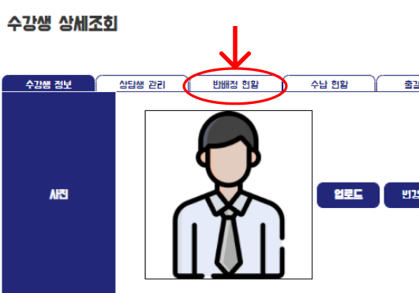
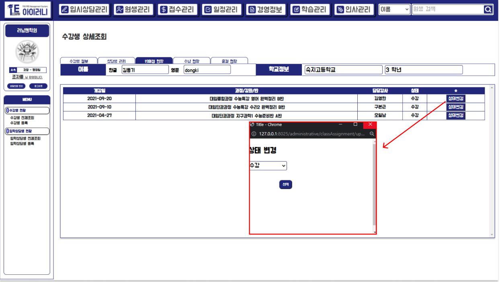

# 반 배정 현황

## 3-2) 반 배정 현황

> 해당 수강생의 반 배정의 모든 현황을 알 수 있는 탭입니다.&#x20;
>
> 또 수강하는 강좌를 포기하거나 혹은 휴원 하거나 퇴원 등을 하였을 시 상태를 변경할 수 있는 기능을 구현하였습니다.

'상세 조회' 화면에서 '반 배정 현황 탭'을 누르면 이동이 가능합니다. 그 후로 어느 탭에서든 해당 탭을 누르면 이동이 가능합니다.&#x20;

### 데이터 베이스 모델 및 사용 테이블

## A. 반 현황 전체 리스트 조회&#x20;

## B. 상태 변경

