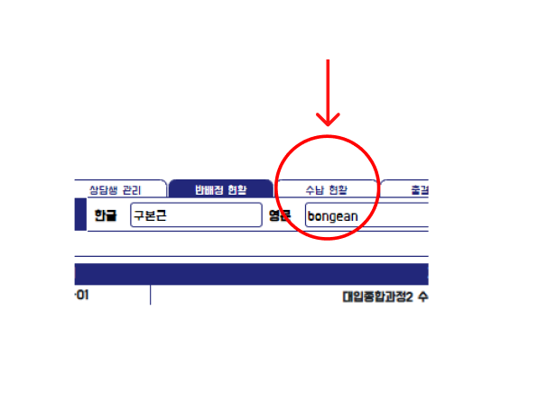
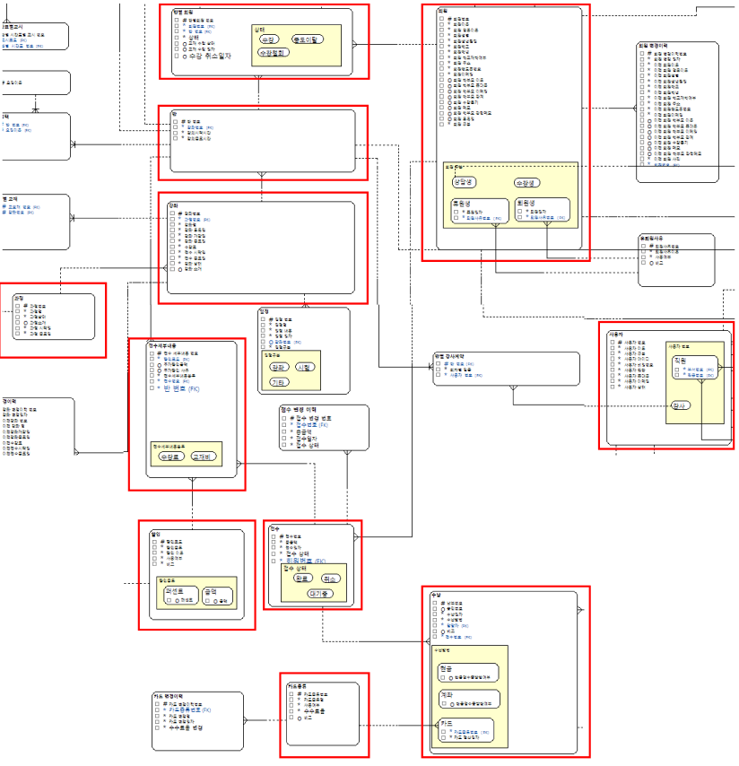
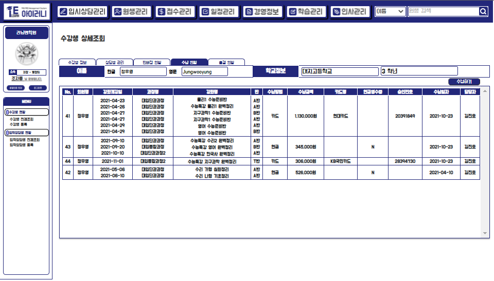

# 수납 현황

## 3-3) 수납 현황

> 해당 원생이 전체 수납 현황을 알 수 있는 페이지 입니다. 수납 결제 담당자와 수납일, 어떤 강좌를 결제하였나 등의 정보를 알 수 있습니다.
>
>

해당 탭을 누르면 '수납 현황' 페이지로 이동이 가능합니다.

### 데이터 베이스 모델 및 사용 테이블

> 수납을 한 직원과 원생, 강좌와 과정, 수납 정보를 사용하기 위해 위의 테이블을 사용하여 구현하였습니다.&#x20;

### A. 원생 수납 현황 리스트 조회

### 화면 설명

> 수강생이 강좌를 수납한 내역을 보여주는 화면입니다. 한 행에 수납한 강좌들이 보여지며 각각 수납하였으면 각각의 행에 표시가 되게 되며, 한번에 수납한 경우 한 행에 보여지게 됩니다. &#x20;
>
> 수납 금액의 경우 현금, 계좌, 카드 가격이 모두 더 해진 금액이며, 카드로 결제를 하였으면 카드 명에 해당 카드 이름이 조회가 됩니다.&#x20;
>
> 미납 현황이 있을 시 수납 하기 버튼을 누르면 '접수관리' 탭의 수납 메뉴로 이동이 됩니다.

### 구현 코드

* view


구현을 하는데 View에서도 참조가 되면서 JPA쿼리가 날아가는게 신기했습니다.&#x20;


