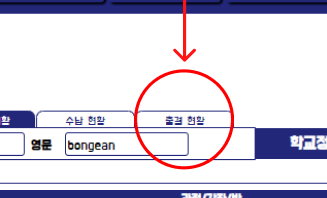
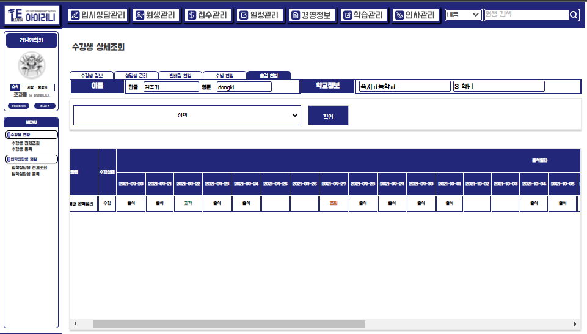
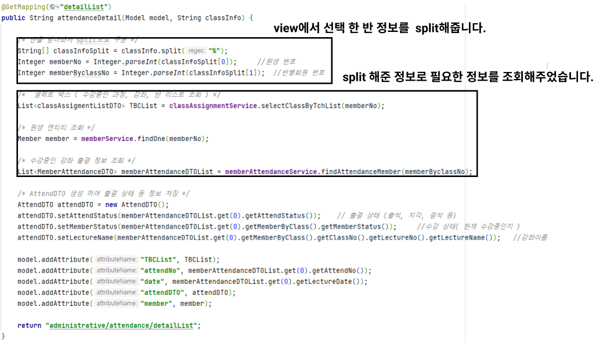
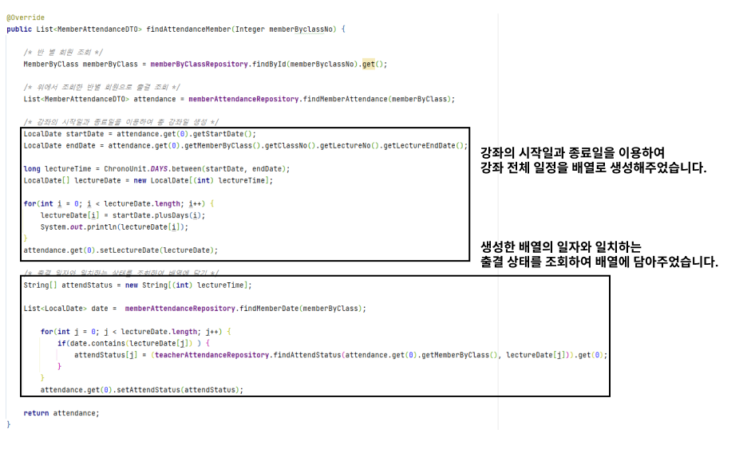
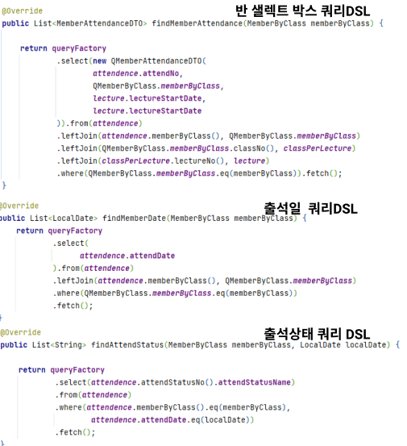
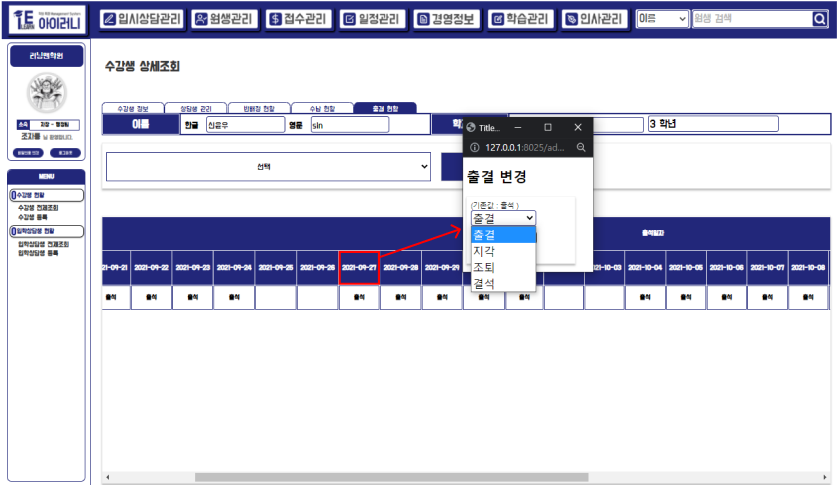
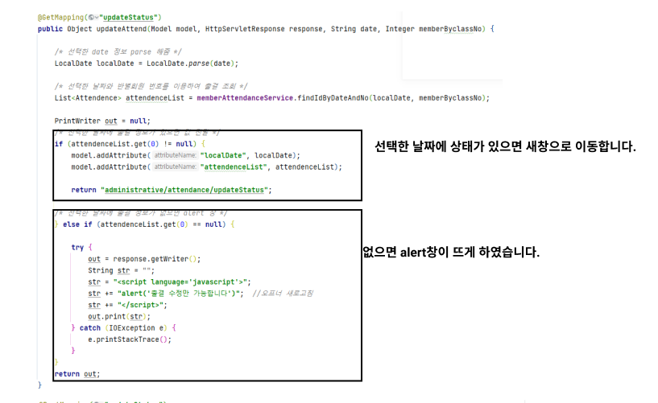
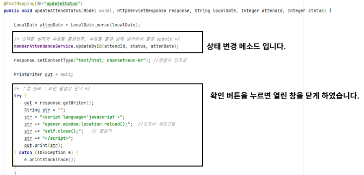
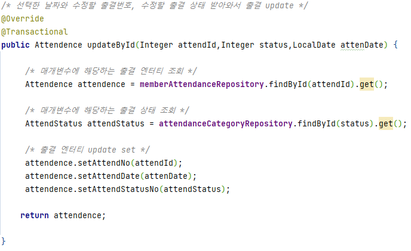

# 출결 현황

## 3-3) 출결 현황

해당 원생이 수강 중인 반의 출결 현황을 알 수 있는 페이지 입니다. 출결 현황을 조회하고 , 출결을 수정 할 수 있습니다.

해당 탭을 클릭하면 출결 현황 페이지로 이동할 수 있습니다.

### A. 반 리스트 조회

### 화면 설명

> 샐렉트 박스에 수강 중인 반의 리스트가 조회됩니다.&#x20;
>
> 해당 반을 선택 후 확인 버튼을 누르면 출결 현황 페이지로 이동됩니다.

### 코드 설명

* Contorller

* Repository


해당 서비스 메소드와 레포지토리 메소드는 다른 팀원이 다른 기능을 위해 만들어 놓은 메소드입니다.&#x20;

하지만 제가 조회할 때 필요한 정보들을 담고 있어, 해당 메소드를 사용하여 제가 필요한 정보만 view에서 골라서 조회하였습니다.&#x20;


### B. 출결 현황 조회

### 화면 설명

> 특정 반을 선택 후 확인 버튼을 누르면 해당 반의 출석 현황을 조회할 수 있습니다.&#x20;
>
> 강좌에 따라 출석 일자가 다르게 조회되며 특정 날짜를 클릭하면 해당 일의 출결 상태를 수정할 수 있는 창이 뜨게 구현 하였습니다.&#x20;

### 구현 코드

* Controller

* ServiceImpl

* RepositoryImpl


해당 기능은 추후에 수정할 예정입니다. 처음 기능을 완성하였을때 정상적으로 동작이 되었으나, 추후에 DB를 추가하니 특정 하나의 반만 조회가 되기 때문입니다.


### B. 출결 상태 수정

.png>)

### 화면 설명

> 출결 상태를 수정 할 날짜를 클릭하면 새 창이 열립니다. 해당 새 창에서 변경할 상태를 클릭 후 확인 버튼을 누르면 출결이 변경되며, 출결 상태에 따라 색이 다르게 표기되게 구현하였습니다.&#x20;

### 구현 코드

* Controller

* ServiceImpl

