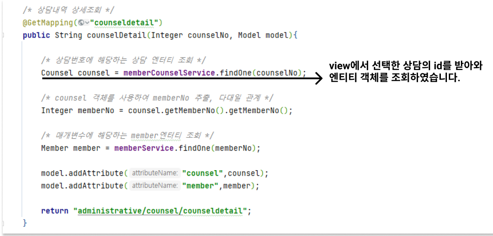

# 상담생 관리

## 3-1) 상담생 관리

상담생 관리 페이지로 이동하기 위해서 우선적으로 '상세조회' 페이지에서 해당 탭을 클릭하면 이동이 가능합니다.

그 후로는 상세조회 탭 뿐만 아니라 어느 탭을 가든 상담생 관리 탭을 누르면 이동이 가능합니다.&#x20;

### 데이터 베이스 모델링 및 사용 테이블&#x20;

> 상담생 관리 탭을 구현 하면서 사용한 테이블 입니다. 해당 상담의 구분은 '입학 상담' 을 제외한 원내 생활 내외를 구분하지 않은 모든 상담을 의미합니다. 때문에 상담 테이블의 목표 대학, 목표 학과, 목표 전형은 Null을 허용해주었습니다.   ex) 입시, 성적 고민, 이성 문제 등

## A. 상담 내용 전체 리스트 조회

### 화면 설명

> 수강생의 상담 내역을 조회 할 수 있는 화면입니다.&#x20;
>
> 상담 구분 등 조건으로 검색을 통해 상담 내역을 찾을 수 있으며, 우측의 상담 내역 추가로 새로운 상담 내역을 등록 할 수 있습니다.&#x20;
>
> 조회 된 상담 내역을 보려면 상세보기 버튼을, 수정하려면 수정 버튼 삭제하려면 삭제 버튼을 누르면 해당 기능이 수행 됩니다.

### 구현 코드&#x20;

.PNG>)

검색 조건은 수강생 전체 리스트 조회에서 썻던 방식과 동일한 방법으로 구현하였습니다.&#x20;

## B. 상담 등록 & 수정

* 등록 화면 입니다.

* 수정 화면

### 화면 설명

> 상담 내용을 등록하는 화면과 수정하는 화면입니다. 상담 구분 등을 입력하여 '상담 작성 완료' 버튼을 누르면 로그인 한 직원의 계정이 작성자로 되어 등록이 완료됩니다. 수정 또한 수정할 내용을 수정 후 '수정 완료' 버튼을 누르면 수정이 완료됩니다. content는 썸머 노트를 이용해 구현하였습니다. &#x20;

### 구현 코드&#x20;

* 상담 등록 Controller

* 상담 수정 Controller

* ServiceImpl


JPA에서 등록과 수정은 같은 save 메소드를 사용하기 때문에 같은 save메소드를 사용하여 보았습니다.&#x20;


## C. 상담 삭제&#x20;

### 화면 설명

> 상담 내용을 삭제하기 위해선 조회된 전체 리스트 화면에서 '삭제 버튼' 을 누릅니다. 그 후 confirm 창의 '확인 버튼' 을 누르면 삭제가 완료 됩니다.

### 구현 코드

* Controller

* ServiceImpl

## D. 상담 내용 상세 조회

### 화면 설명

> 등록한 상담 내용을 자세히 볼 수 있는 화면입니다. 전체 리스트 조회 화면에서 '상세 보기' 버튼을 누르면 해당 화면으로 진입이 가능하도록 하였습니다.&#x20;

### 구현 코드

* Controller

* ServiceImpl

