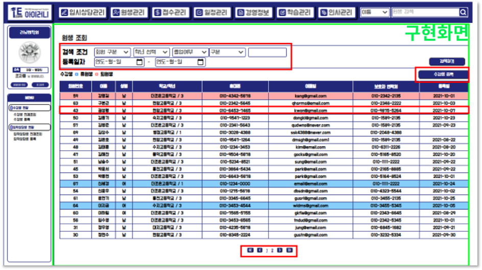
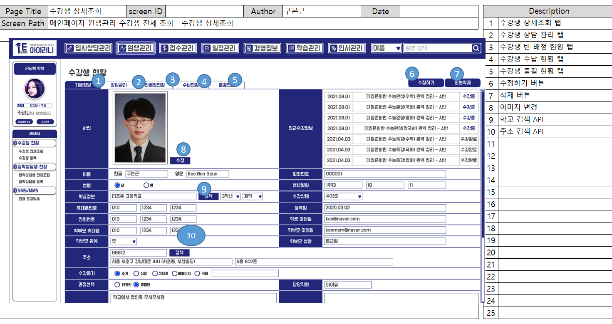

# 수강생 전체 조회, 등록, 수정

## (1) 수강생 전체 조회

### A. 단위 업무 흐름도

> 수강생 전체 조회는 메인 페이지에서 수강생 현황 메뉴 아래의 수강생 전체 조회를 선택하면 데이터 베이스에서 수강생 정보를 조회하여 화면에 보여주게 됩니다.

### B. 데이터 베이스 모델

> 해당 기능을 구현하기 위해 필요한 엔티티 입니다.&#x20;
>
> 회원 등록일이 Null 허용인 이유로는 1:1관계인 '입학 상담생' 테이블이 있어서 입니다.  접수를 동해 수납이 확인 되면 등록일이 자동으로 생성되지만 입학 상담생은 접수를 하지 않기 때문에 Not Null 조건을 풀어주었습니다. &#x20;

### C. 화면정의서

> 권한이 있는 아이디로 로그인 후, 상단바의 원생 관리 탭을 클릭 후 수강생 현황에 들어가면 등록된 수강생의 현황 리스트가 조회되며  한 페이지에 총 20명씩 조회가 가능합니다.
>
> 검색 조건을 통해 특정인들을 따로 조회할 수 있고, 원하는 한명의 원생의 행을 클릭하면 상세 페이지로 이동합니다.  또 수강생 등록 버튼을 통해 등록 페이지로 이동이 가능합니다.

### D. 시퀀스 다이어그램

> 수강생 전체 조회 화면에 들어가면 DB에서 수강생 리스트를 조회하여 view로 뿌려줍니다.&#x20;

### 1-1) 구현 화면

> &#x20;퇴원생은 빨간색 휴원생은 파란색으로 표시됩니다.
>
> 화면 정의서와 달라진 점은 사이드 바의 메뉴 통합입니다.&#x20;

### 1-2) 구현 코드

* Controller


JPA를 사용하여 구현하였습니다.&#x20;

때문에 Member 엔티티를 생성 후 이를 객체 타입으로 전달해주었습니다.


* ServiceImpl


Repository에서 받은 결과를 memberList 변수로 선언하여 return 해주었습니다.


* RepositoryImpl


'상담생' 은 제외 하기 때문에 Where절을 통해 조건을 주었으며, 검색 조건들을 메소드로 만들어 조건 절에 포함 시켜 주었습니다. 검색 조건을 메소드로 만들어 주어  해당 로직 말고 다른 로직에서도 같은 검색 조건을 사용 할 수 있게 재사용성을 높일 수 있었습니다.&#x20;


## (2) 수강생 등록

### A. 단위 업무 흐름도

.PNG>)

> 수강생을 등록하기 위해 수강생 리스트 조회 화면에서 '등록하기' 버튼을 눌러 수강생 등록 화면으로 보여집니다.&#x20;
>
> 이 등록 화면에서 수강생의 정보와 직원 조회를 통해 담당 직원을 배정하여 준 다음 등록을 하면 DB에 Insert되는 방식으로 구현 할 생각입니다.

### B. 데이터 베이스 모델

### C. 화면 정의서

> 수강생 등록 화면입니다.  수강생의 정보를 입력 후 등록하기 버튼을 누르면 DB에 Insert됩니다.&#x20;

### D. 시퀀스 다이어그램

> 등록을 하면 DB에 저장 된 후 결과 result를 return합니다.

> 등록을 하기 전에 담당 직원을 입력해야 하기 때문에 직원을 DB에서 조회하여 list로 반환합니다.

### 2-1) 구현 화면

> &#x20;한 명의 신규 수강생을 등록하는 화면입니다. 이름, 나이, 학교, 학년 등과 같은 학생의 정보를 입력할 수 있고, 카카오의 우편 주소 API를 사용하여 주소 검색을 하였습니다. 담당 직원도 검색 버튼을 누르면 새 창이 열리며 한 명의 담당 직원을 선택하여 입력 할 수 있습니다.&#x20;

### 2-2) 구현 코드

* 등록을 위한 Form 객체


원생 등록 할 때 필요한 변수들을 선언해 주었고, hibernate-validator 어노테이션을 사용하여 필수 값을 예외 처리해주었습니다.


* 수강생 등록 Controller


view에서 사용자가 입력하여 전달 받은 객체인 MemberForm에 @Valid나 @Validated 어노테이션을 붙여주고 BindingResult를 사용하여 어떤 오류가 발생했나 알려주는 방법으로 예외처리를 하였습니다.(Validator를 상속받는 클래스에서 객체값을 검증하는 방식)


* 예외처리 된 화면

* 수강생 등록 ServiceImpl


등록 Form 객체에서 받은 값을 Member Entity에 set을 해주었습니다.

&#x20;Repository는 JPARepository를 상속받고 있어 제공해주는 save 메소드를 사용하여 등록을 완료하였습니다.&#x20;


* 직원 검색 DTO


직원 조회를 위한 DTO입니다. QueryDSL을 사용하기 위해서 QueryProjection 어노테이션을 달아주어 Q타입 객체 생성해주었습니다.


* 직원 검색 Controller

* 직원 검색 ServiceImpl

* 직원 검색 RepositoryImpl


학교 검색은 공공API를 사용하여 추후에 개발 할 예정입니다.&#x20;


## (3) 수강생 수정

### A. 단위 업무 흐름도

> 수강생 정보를 수정하기 위해선 우선 수강생의 상세 정보 화면으로 들어갑니다.&#x20;
>
> 수정할 정보를 수정하여 주고 수정하기 버튼을 누르면 수강생 정보가 update 되는 흐름입니다.

### B. 데이터 베이스 모델

> 수강생 수정을 하는데 사용한 테이블입니다. 기존의 회원 정보를 변경 이력 테이블에 insert해주고, 변경된 정보는 회원(member)테이블에 update 해주었습니다.

### C. 화면 정의서

> 수강생 상세 조회 화면이자 수정화면입니다. 수정할 정보를 수정 후 '수정하기' 버튼을 클릭하면 수강생의 정보가 update 되며, 동시에 기존의 정보는 변경이력 테이블에 insert가 됩니다.&#x20;

### D. 시퀀스 다이어그램

> 수정하기 전 수강생 상세 조회를 해야하기 때문에 우선적으로 상세조회를 DB에서 해줍니다.
>
> 조회 된 정보에서 사용자가 수정할 정보를 수정하여 DB에 update 후 결과를 return 받습니다.&#x20;

### 3-1) 구현 화면

### 3-2) 구현 코드

## 3) 수강생 상세 조회

### A. 단위 업무 흐름도

> 수강생 정보를 상세 조회 하기 위해서 수강생 현황의 전체 리스트를 우선 조회합니다. 그 후 상세 보기를 원하는 한 명의 원생을 클릭하면 해당 원생의 정보를 상세 보기 할 수 있습니다.&#x20;

### B. 데이터 베이스 모델

### C. 화면 정의서

> 상세보기 화면 정의서 입니다. 수정도 동시에 할 수 있는 화면이며** '상담 관리', '반 배정 현황', '수납현황', '출결 현황'의 탭으로 이동 할 수 있는 기점 화면** 이기도 합니다.

### D. 시퀀스 다이어그램

### 1-1) 구현 화면

.PNG>)

> 상세 조회 페이지 구현 화면 입니다.  화면 정의서와 다른 점으로는** '수강생 삭제' 버튼을 없앴습**니다.&#x20;
>
> **대신 수강생의 상태를 변경하는 기능을 넣었으**며, ** '입학 상담' 을 진행한 기록이 있는 회원**이면 상태 변경 기능 옆에** '입학상담내용' 버튼이 보이도록 화면**을 **구현**하였습니다.

### 1-2) 구현 코드


여기서 직원 검색은 수강생 등록과 같은 로직이므로 생략하겠습니다.

이미지 변경 기능은 따로 목차를 만들었습니다.&#x20;


* controller

.PNG>)

* serviceImpl

* RepositoryImpl

