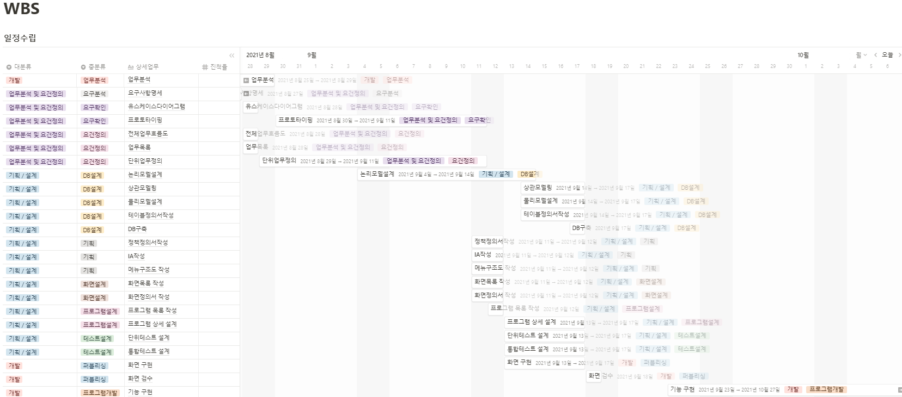
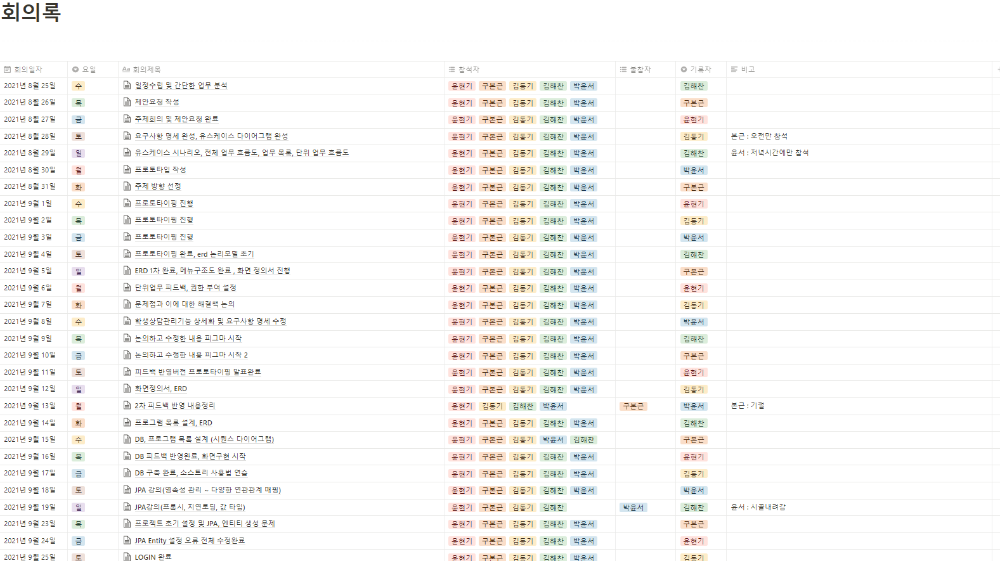
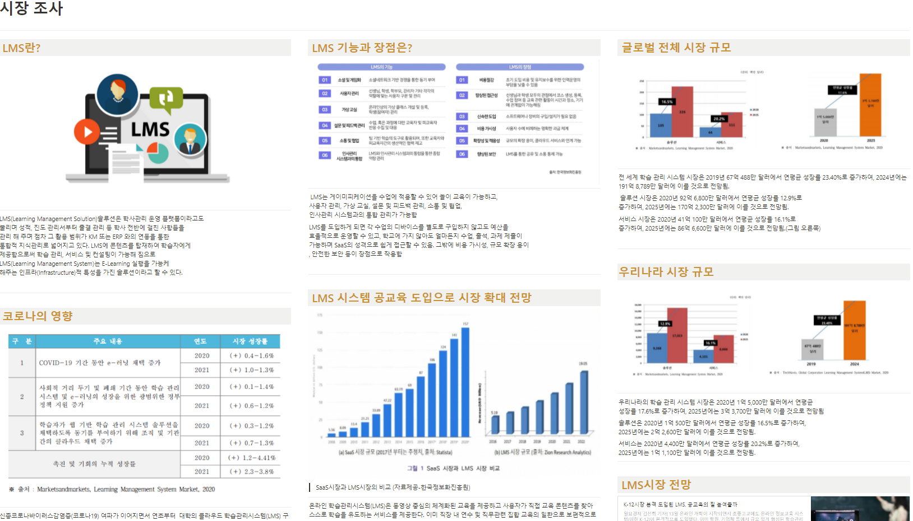
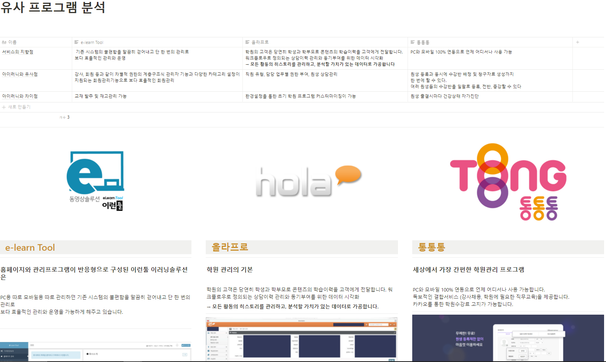
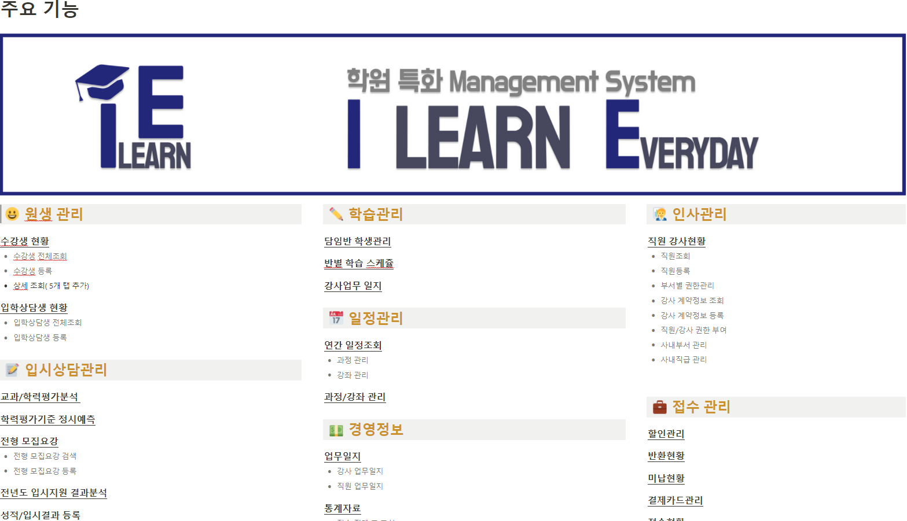
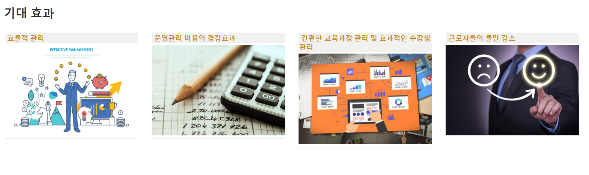

# 기획

## 1. 프로젝트 계획 수립

### 1-1.  일정 관리

노션을 사용하여 WBS(work-breakdown structure) 형식으로 하여, 기획 단계부터 개발까지 일정을 수립하였으며, 당겨지거나 밀린 일정들은 바로바로 업데이트 해주어 지정된 기간 안에 일정대로 마무리 할 수 었습니다.

### 1-2.  회의

## 2. 제안 요청

### 2-1. 시장 조사

시장 조사를 통해 LMS에 대한 전반적인 지식을 쌓았으며 프로젝트의 방향을 결정하는데에 전략과 계획을 세우는데 도움이 되었습니다.&#x20;

### 2-2. 유사프로그램 분&#x20;

유사 프로그램(e-learn Tool, 올라프로, 통통통)의 기능을조사하였습니다.

이를 통해 팀이 구성한 프로젝트와의 유사점과 차이점을 비교하여 저희만의 특색과 지향점을 도출했습니다.

### 2-3. 주요 기능

아이러니(I LEARN E)의 구현기능을 메뉴별로 구조화 하여 정리하였습니다.

### 2-4. 기대 효&#x20;

