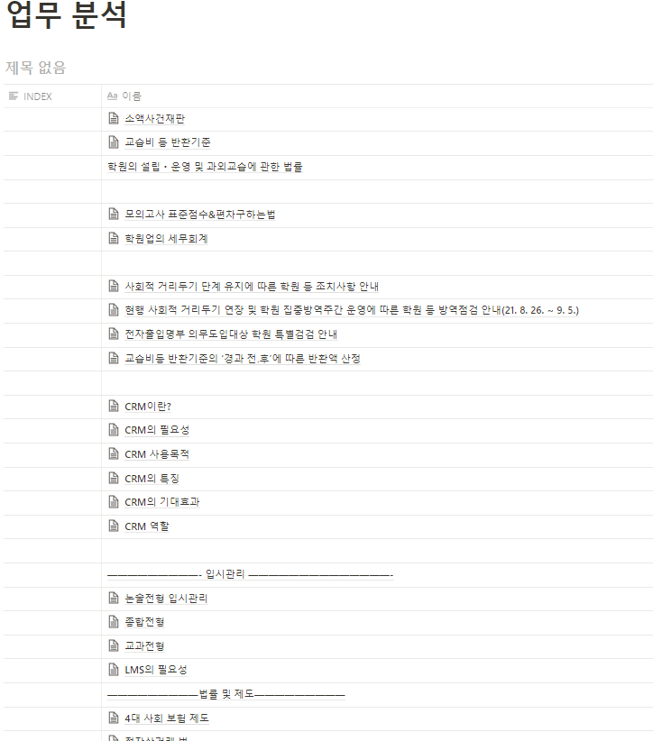
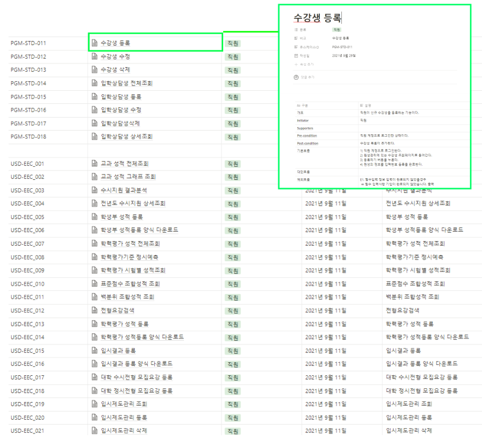
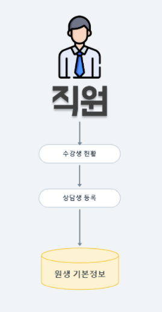
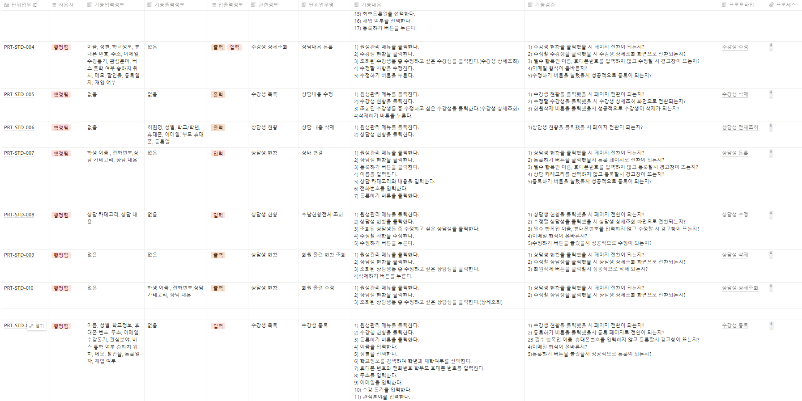

# 기획

## 1. 프로젝트 계획 수립

### 1-1. 일정 관리

노션을 사용하여 WBS(work-breakdown structure) 형식으로 하여, 기획 단계부터 개발까지 일정을 수립하였으며, 당겨지거나 밀린 일정들은 바로바로 업데이트 해주어 지정된 기간 안에 일정대로 마무리 할 수 었습니다.

### 1-2. 회의록

회의가 발생할 건이 생기면 팀원이 모두 모여 회의를 해당 안건에 대해 회의를 진행하여 기록하여 두었습니다.&#x20;

## 2. 제안 요청

### 2-1. 시장 조사

시장 조사를 통해 LMS에 대한 전반적인 지식을 쌓았으며 프로젝트의 방향을 결정하는데에 전략과 계획을 세우는데 도움이 되었습니다.

### 2-2. 유사프로그램 분

유사 프로그램(e-learn Tool, 올라프로, 통통통)의 기능을조사하였습니다.

이를 통해 팀이 구성한 프로젝트와의 유사점과 차이점을 비교하여 저희만의 특색과 지향점을 도출했습니다.

### 2-3. 주요 기능

아이러니(I LEARN E)의 구현기능을 메뉴별로 구조화 하여 정리하였습니다.

### 2-4. 기대 효과

## 3. 업무 분석 및 요건 정의

### 3-1. 업무 분석

저희 프로젝트는 CRM의 성격도 강하기 때문에 LMS와 CRM을 적절히 조화하여 만들면서 알아야 하는 기본 개념과 법률 등을 분석하였습니다.

### 3-2. 유스케이스 시나리오


\-+ 버튼을 눌러 배율 조절을 할 수 있습니다.


유스케이스 다이어그램으로 요구사항을 정의하여 개발 범위를 정하였습니다.

유스케이스 다이어그램을 그려 봄으로써 사용자의 관점을 빠르게 이해하여 시스템의 상호 작용을 확인할 수 있고, 요구사항을 구조화 하여 프로세스를 파악하는데 한층 더 수월했습니다.&#x20;

이후 프로세스 별로 유스케이스 시나리오를 작성하여 시스템 사용방법을 보다 쉽게 파악하는데 용이했습니다.

### 3-3. 전체 업무 흐름도 및 단위 업무 흐름도


\-+ 버튼을 눌러 배율 조절을 할 수 있습니다.


크게 사용자 별로 나누어 업무 흐름도를 완성 시켰습니다.&#x20;

&#x20;각자 맡은 파트 기능은 어떤 흐름으로 DB에 인풋&아웃풋이 되는지 데이터의 전체적인 흐름을 파악하는데 용이했습니다.&#x20;

또한 단위 업무 프로세스에 따라 단위 업무 흐름도 역시 작업하였습니다.

### 3-4. 단위 업무 정의서&#x20;

전체 업무의 프로세스를 기능 단위로 도출하여 단위 프로세스의 업무 기능을 명확히 하여 기능의 내용과 기능 검증의 내용을 각자 맡은 파트에 대해 작성하였습니다.&#x20;

### 3-5. 프로토타이핑

{% embed url="https://www.figma.com/proto/98dV7SOYR2upXeqIQ0ARWU/%EC%95%84%EB%8B%88%EB%9F%AC%EB%8B%88-%EC%84%AC%EB%A9%80%ED%8B%B0?node-id=86%3A15585&page-id=0%3A1&scaling=scale-down-width&show-proto-sidebar=1&starting-point-node-id=86%3A15673&viewport=241%2C48%2C0.02" %}
z키 를 눌러서 화면비를 조절 할 수 있습니다.


프로토타이핑을 만들어 저희가 만들 프로그램의 기능을 점검하고 발생할 문제점을 미리 파악하여 프로젝트에 대한 이해도를 한층 더 높일 수 있었습니다.

